```python
# importing libraries
import pandas as pd
import matplotlib.pyplot as plt
import seaborn as sns
from sklearn.decomposition import PCA
from sklearn.preprocessing import MinMaxScaler

# read the file from anaconda cloud, just first 10 rows to see if it works
file_name = 'all_ticks_wide.csv.gz'
sample_df = pd.read_csv(file_name, compression='gzip', nrows = 10)
display(sample_df)


```


<div>
<style scoped>
    .dataframe tbody tr th:only-of-type {
        vertical-align: middle;
    }

    .dataframe tbody tr th {
        vertical-align: top;
    }

    .dataframe thead th {
        text-align: right;
    }
</style>
<table border="1" class="dataframe">
  <thead>
    <tr style="text-align: right;">
      <th></th>
      <th>timestamp</th>
      <th>AEFES</th>
      <th>AKBNK</th>
      <th>AKSA</th>
      <th>AKSEN</th>
      <th>ALARK</th>
      <th>ALBRK</th>
      <th>ANACM</th>
      <th>ARCLK</th>
      <th>ASELS</th>
      <th>ASUZU</th>
      <th>AYGAZ</th>
      <th>BAGFS</th>
      <th>BANVT</th>
      <th>BRISA</th>
      <th>CCOLA</th>
      <th>CEMAS</th>
      <th>ECILC</th>
      <th>EREGL</th>
      <th>FROTO</th>
      <th>GARAN</th>
      <th>GOODY</th>
      <th>GUBRF</th>
      <th>HALKB</th>
      <th>ICBCT</th>
      <th>ISCTR</th>
      <th>ISDMR</th>
      <th>ISFIN</th>
      <th>ISYAT</th>
      <th>KAREL</th>
      <th>KARSN</th>
      <th>KCHOL</th>
      <th>KRDMB</th>
      <th>KRDMD</th>
      <th>MGROS</th>
      <th>OTKAR</th>
      <th>PARSN</th>
      <th>PETKM</th>
      <th>PGSUS</th>
      <th>PRKME</th>
      <th>SAHOL</th>
      <th>SASA</th>
      <th>SISE</th>
      <th>SKBNK</th>
      <th>SODA</th>
      <th>TCELL</th>
      <th>THYAO</th>
      <th>TKFEN</th>
      <th>TOASO</th>
      <th>TRKCM</th>
      <th>TSKB</th>
      <th>TTKOM</th>
      <th>TUKAS</th>
      <th>TUPRS</th>
      <th>USAK</th>
      <th>VAKBN</th>
      <th>VESTL</th>
      <th>YATAS</th>
      <th>YKBNK</th>
      <th>YUNSA</th>
      <th>ZOREN</th>
    </tr>
  </thead>
  <tbody>
    <tr>
      <th>0</th>
      <td>2012-09-17T06:45:00Z</td>
      <td>22.3978</td>
      <td>5.2084</td>
      <td>1.7102</td>
      <td>3.87</td>
      <td>1.4683</td>
      <td>1.1356</td>
      <td>1.0634</td>
      <td>6.9909</td>
      <td>2.9948</td>
      <td>2.4998</td>
      <td>3.5396</td>
      <td>37.4875</td>
      <td>3.95</td>
      <td>3.9666</td>
      <td>27.2590</td>
      <td>1.20</td>
      <td>0.8046</td>
      <td>0.7914</td>
      <td>12.0559</td>
      <td>6.3715</td>
      <td>1.8479</td>
      <td>2.7434</td>
      <td>12.9606</td>
      <td>0.72</td>
      <td>4.0807</td>
      <td>NaN</td>
      <td>0.2450</td>
      <td>0.2065</td>
      <td>1.8469</td>
      <td>1.0818</td>
      <td>6.0642</td>
      <td>1.3738</td>
      <td>0.7165</td>
      <td>19.60</td>
      <td>24.1387</td>
      <td>2.86</td>
      <td>0.7866</td>
      <td>NaN</td>
      <td>4.3021</td>
      <td>6.8172</td>
      <td>0.3002</td>
      <td>0.9932</td>
      <td>1.1651</td>
      <td>0.3178</td>
      <td>4.5359</td>
      <td>3.3661</td>
      <td>4.8172</td>
      <td>5.5142</td>
      <td>0.4344</td>
      <td>0.8294</td>
      <td>4.2639</td>
      <td>0.96</td>
      <td>29.8072</td>
      <td>1.0382</td>
      <td>3.8620</td>
      <td>1.90</td>
      <td>0.4172</td>
      <td>2.5438</td>
      <td>2.2619</td>
      <td>0.7789</td>
    </tr>
    <tr>
      <th>1</th>
      <td>2012-09-17T07:00:00Z</td>
      <td>22.3978</td>
      <td>5.1938</td>
      <td>1.7066</td>
      <td>3.86</td>
      <td>1.4574</td>
      <td>1.1275</td>
      <td>1.0634</td>
      <td>6.9259</td>
      <td>2.9948</td>
      <td>2.5100</td>
      <td>3.5483</td>
      <td>37.2769</td>
      <td>3.96</td>
      <td>3.9666</td>
      <td>27.3471</td>
      <td>1.19</td>
      <td>0.8088</td>
      <td>0.7844</td>
      <td>11.9592</td>
      <td>6.3386</td>
      <td>1.8479</td>
      <td>2.7541</td>
      <td>12.8742</td>
      <td>0.72</td>
      <td>4.0519</td>
      <td>NaN</td>
      <td>0.2450</td>
      <td>0.2065</td>
      <td>1.8237</td>
      <td>1.0818</td>
      <td>6.0475</td>
      <td>1.3608</td>
      <td>0.7165</td>
      <td>19.35</td>
      <td>24.1387</td>
      <td>2.84</td>
      <td>0.7829</td>
      <td>NaN</td>
      <td>4.2892</td>
      <td>6.7831</td>
      <td>0.2955</td>
      <td>0.9897</td>
      <td>1.1651</td>
      <td>0.3178</td>
      <td>4.5153</td>
      <td>3.3574</td>
      <td>4.8172</td>
      <td>5.5142</td>
      <td>0.4344</td>
      <td>0.8294</td>
      <td>4.2521</td>
      <td>0.96</td>
      <td>29.7393</td>
      <td>1.0382</td>
      <td>3.8529</td>
      <td>1.90</td>
      <td>0.4229</td>
      <td>2.5266</td>
      <td>2.2462</td>
      <td>0.7789</td>
    </tr>
    <tr>
      <th>2</th>
      <td>2012-09-17T07:15:00Z</td>
      <td>22.3978</td>
      <td>5.2084</td>
      <td>1.7102</td>
      <td>NaN</td>
      <td>1.4610</td>
      <td>1.1356</td>
      <td>1.0679</td>
      <td>6.9909</td>
      <td>2.9855</td>
      <td>2.4796</td>
      <td>3.5483</td>
      <td>37.2769</td>
      <td>3.96</td>
      <td>3.9356</td>
      <td>27.3471</td>
      <td>1.19</td>
      <td>0.8088</td>
      <td>0.7914</td>
      <td>11.8950</td>
      <td>6.3386</td>
      <td>1.8479</td>
      <td>2.7541</td>
      <td>12.9174</td>
      <td>0.72</td>
      <td>4.0519</td>
      <td>NaN</td>
      <td>0.2422</td>
      <td>0.2065</td>
      <td>1.8237</td>
      <td>1.0726</td>
      <td>6.0475</td>
      <td>1.3608</td>
      <td>0.7165</td>
      <td>19.40</td>
      <td>24.2013</td>
      <td>2.85</td>
      <td>0.7903</td>
      <td>NaN</td>
      <td>4.2892</td>
      <td>6.7831</td>
      <td>0.2955</td>
      <td>0.9932</td>
      <td>1.1561</td>
      <td>0.3178</td>
      <td>4.5153</td>
      <td>3.3661</td>
      <td>4.8317</td>
      <td>5.5142</td>
      <td>0.4364</td>
      <td>0.8294</td>
      <td>4.2521</td>
      <td>0.97</td>
      <td>29.6716</td>
      <td>1.0463</td>
      <td>3.8436</td>
      <td>1.91</td>
      <td>0.4229</td>
      <td>2.5266</td>
      <td>2.2566</td>
      <td>0.7789</td>
    </tr>
    <tr>
      <th>3</th>
      <td>2012-09-17T07:30:00Z</td>
      <td>22.3978</td>
      <td>5.1938</td>
      <td>1.7102</td>
      <td>3.86</td>
      <td>1.4537</td>
      <td>1.1275</td>
      <td>1.0679</td>
      <td>6.9584</td>
      <td>2.9855</td>
      <td>2.4897</td>
      <td>3.5396</td>
      <td>37.3822</td>
      <td>3.95</td>
      <td>3.9666</td>
      <td>27.4347</td>
      <td>1.20</td>
      <td>0.8088</td>
      <td>0.7914</td>
      <td>11.9592</td>
      <td>6.3715</td>
      <td>1.8648</td>
      <td>2.7541</td>
      <td>12.9606</td>
      <td>0.72</td>
      <td>4.0663</td>
      <td>NaN</td>
      <td>NaN</td>
      <td>NaN</td>
      <td>1.8391</td>
      <td>1.0726</td>
      <td>6.0475</td>
      <td>1.3673</td>
      <td>0.7104</td>
      <td>19.45</td>
      <td>24.3888</td>
      <td>2.86</td>
      <td>0.7903</td>
      <td>NaN</td>
      <td>4.2763</td>
      <td>6.7831</td>
      <td>0.2955</td>
      <td>0.9897</td>
      <td>1.1561</td>
      <td>0.3168</td>
      <td>4.5359</td>
      <td>3.3748</td>
      <td>4.8172</td>
      <td>5.5142</td>
      <td>0.4364</td>
      <td>0.8253</td>
      <td>4.2521</td>
      <td>0.97</td>
      <td>29.7393</td>
      <td>1.0382</td>
      <td>3.8529</td>
      <td>1.91</td>
      <td>0.4286</td>
      <td>2.5324</td>
      <td>2.2619</td>
      <td>0.7860</td>
    </tr>
    <tr>
      <th>4</th>
      <td>2012-09-17T07:45:00Z</td>
      <td>22.5649</td>
      <td>5.2084</td>
      <td>1.7102</td>
      <td>3.87</td>
      <td>1.4574</td>
      <td>1.1356</td>
      <td>1.0725</td>
      <td>6.9909</td>
      <td>2.9760</td>
      <td>2.4897</td>
      <td>3.5396</td>
      <td>37.4875</td>
      <td>3.96</td>
      <td>3.9666</td>
      <td>27.4347</td>
      <td>1.20</td>
      <td>0.8130</td>
      <td>0.7914</td>
      <td>11.9914</td>
      <td>6.3715</td>
      <td>1.8648</td>
      <td>2.7541</td>
      <td>12.9606</td>
      <td>0.73</td>
      <td>4.0807</td>
      <td>NaN</td>
      <td>0.2422</td>
      <td>0.2086</td>
      <td>1.8314</td>
      <td>1.0726</td>
      <td>6.0309</td>
      <td>1.3608</td>
      <td>0.7104</td>
      <td>19.40</td>
      <td>24.3888</td>
      <td>2.85</td>
      <td>0.7941</td>
      <td>NaN</td>
      <td>4.2763</td>
      <td>6.7831</td>
      <td>0.2979</td>
      <td>0.9970</td>
      <td>1.1651</td>
      <td>0.3178</td>
      <td>4.5153</td>
      <td>3.3748</td>
      <td>4.8317</td>
      <td>5.5264</td>
      <td>0.4404</td>
      <td>0.8253</td>
      <td>4.2521</td>
      <td>0.97</td>
      <td>29.8072</td>
      <td>1.0382</td>
      <td>3.8620</td>
      <td>1.90</td>
      <td>0.4286</td>
      <td>2.5324</td>
      <td>2.2619</td>
      <td>0.7789</td>
    </tr>
    <tr>
      <th>5</th>
      <td>2012-09-17T08:00:00Z</td>
      <td>22.5649</td>
      <td>5.2229</td>
      <td>1.7102</td>
      <td>3.86</td>
      <td>1.4610</td>
      <td>1.1275</td>
      <td>1.0725</td>
      <td>6.9584</td>
      <td>2.9760</td>
      <td>2.4897</td>
      <td>3.5396</td>
      <td>37.3822</td>
      <td>3.95</td>
      <td>3.9666</td>
      <td>27.4347</td>
      <td>1.20</td>
      <td>0.8172</td>
      <td>0.7914</td>
      <td>12.0234</td>
      <td>6.3715</td>
      <td>1.8648</td>
      <td>2.7646</td>
      <td>12.9606</td>
      <td>NaN</td>
      <td>4.0807</td>
      <td>NaN</td>
      <td>0.2450</td>
      <td>0.2065</td>
      <td>1.8391</td>
      <td>1.0726</td>
      <td>6.0143</td>
      <td>1.3673</td>
      <td>0.7042</td>
      <td>19.45</td>
      <td>24.3888</td>
      <td>2.84</td>
      <td>0.7903</td>
      <td>NaN</td>
      <td>4.2633</td>
      <td>6.8002</td>
      <td>0.2979</td>
      <td>0.9970</td>
      <td>1.1651</td>
      <td>0.3189</td>
      <td>4.5359</td>
      <td>3.3748</td>
      <td>4.8463</td>
      <td>5.5383</td>
      <td>0.4404</td>
      <td>0.8294</td>
      <td>4.2402</td>
      <td>NaN</td>
      <td>29.8072</td>
      <td>1.0382</td>
      <td>3.8620</td>
      <td>1.91</td>
      <td>0.4314</td>
      <td>2.5381</td>
      <td>2.2566</td>
      <td>0.7860</td>
    </tr>
    <tr>
      <th>6</th>
      <td>2012-09-17T08:15:00Z</td>
      <td>22.5649</td>
      <td>5.2229</td>
      <td>1.7066</td>
      <td>NaN</td>
      <td>1.4610</td>
      <td>1.1275</td>
      <td>1.0679</td>
      <td>6.9584</td>
      <td>2.9760</td>
      <td>2.4998</td>
      <td>3.5483</td>
      <td>37.2769</td>
      <td>3.96</td>
      <td>3.9821</td>
      <td>27.3471</td>
      <td>1.20</td>
      <td>0.8172</td>
      <td>0.7914</td>
      <td>12.0559</td>
      <td>6.3715</td>
      <td>1.8648</td>
      <td>2.7646</td>
      <td>12.9606</td>
      <td>0.73</td>
      <td>4.0663</td>
      <td>NaN</td>
      <td>0.2450</td>
      <td>NaN</td>
      <td>1.8314</td>
      <td>1.0726</td>
      <td>6.0143</td>
      <td>1.3608</td>
      <td>0.7104</td>
      <td>19.45</td>
      <td>24.5137</td>
      <td>NaN</td>
      <td>0.7903</td>
      <td>NaN</td>
      <td>4.2633</td>
      <td>6.8002</td>
      <td>0.2979</td>
      <td>0.9932</td>
      <td>1.1651</td>
      <td>0.3189</td>
      <td>4.5359</td>
      <td>3.3748</td>
      <td>4.8463</td>
      <td>5.5264</td>
      <td>0.4384</td>
      <td>0.8253</td>
      <td>4.2402</td>
      <td>0.97</td>
      <td>29.6716</td>
      <td>1.0382</td>
      <td>3.8529</td>
      <td>1.91</td>
      <td>0.4286</td>
      <td>2.5324</td>
      <td>2.2566</td>
      <td>0.7789</td>
    </tr>
    <tr>
      <th>7</th>
      <td>2012-09-17T08:30:00Z</td>
      <td>22.5649</td>
      <td>5.2084</td>
      <td>1.7066</td>
      <td>3.86</td>
      <td>1.4610</td>
      <td>NaN</td>
      <td>1.0725</td>
      <td>6.9909</td>
      <td>2.9855</td>
      <td>2.4897</td>
      <td>3.5483</td>
      <td>37.1716</td>
      <td>3.96</td>
      <td>3.9977</td>
      <td>27.1710</td>
      <td>1.20</td>
      <td>0.8172</td>
      <td>0.7879</td>
      <td>12.0234</td>
      <td>6.3386</td>
      <td>1.8817</td>
      <td>2.7541</td>
      <td>12.9174</td>
      <td>0.72</td>
      <td>4.0519</td>
      <td>NaN</td>
      <td>NaN</td>
      <td>NaN</td>
      <td>NaN</td>
      <td>1.0726</td>
      <td>6.0143</td>
      <td>1.3608</td>
      <td>0.7104</td>
      <td>19.40</td>
      <td>24.4515</td>
      <td>2.84</td>
      <td>0.7903</td>
      <td>NaN</td>
      <td>4.2633</td>
      <td>6.8002</td>
      <td>0.2979</td>
      <td>0.9932</td>
      <td>1.1651</td>
      <td>0.3189</td>
      <td>4.5359</td>
      <td>3.3661</td>
      <td>4.8463</td>
      <td>5.5383</td>
      <td>0.4384</td>
      <td>0.8253</td>
      <td>4.2168</td>
      <td>0.97</td>
      <td>29.7393</td>
      <td>1.0463</td>
      <td>3.8529</td>
      <td>1.91</td>
      <td>0.4286</td>
      <td>2.5266</td>
      <td>2.2566</td>
      <td>0.7860</td>
    </tr>
    <tr>
      <th>8</th>
      <td>2012-09-17T08:45:00Z</td>
      <td>22.5649</td>
      <td>5.2372</td>
      <td>1.6995</td>
      <td>NaN</td>
      <td>1.4610</td>
      <td>1.1275</td>
      <td>1.0725</td>
      <td>6.9909</td>
      <td>2.9855</td>
      <td>2.4998</td>
      <td>3.5396</td>
      <td>37.1716</td>
      <td>3.95</td>
      <td>3.9821</td>
      <td>27.2590</td>
      <td>1.20</td>
      <td>0.8130</td>
      <td>0.7914</td>
      <td>12.0234</td>
      <td>6.3715</td>
      <td>1.8817</td>
      <td>2.7541</td>
      <td>12.9606</td>
      <td>0.72</td>
      <td>4.0807</td>
      <td>NaN</td>
      <td>0.2450</td>
      <td>0.2086</td>
      <td>1.8469</td>
      <td>1.0636</td>
      <td>6.0309</td>
      <td>1.3673</td>
      <td>0.7104</td>
      <td>19.45</td>
      <td>24.3888</td>
      <td>2.85</td>
      <td>0.7903</td>
      <td>NaN</td>
      <td>4.2633</td>
      <td>6.8002</td>
      <td>0.2979</td>
      <td>0.9932</td>
      <td>1.1561</td>
      <td>0.3189</td>
      <td>4.5979</td>
      <td>3.3748</td>
      <td>4.8608</td>
      <td>5.5383</td>
      <td>0.4384</td>
      <td>0.8212</td>
      <td>4.2285</td>
      <td>0.96</td>
      <td>29.7393</td>
      <td>1.0382</td>
      <td>3.8620</td>
      <td>1.90</td>
      <td>0.4314</td>
      <td>2.5381</td>
      <td>2.2514</td>
      <td>0.7789</td>
    </tr>
    <tr>
      <th>9</th>
      <td>2012-09-17T09:00:00Z</td>
      <td>22.5649</td>
      <td>5.2372</td>
      <td>1.6995</td>
      <td>3.86</td>
      <td>1.4610</td>
      <td>1.1356</td>
      <td>1.0725</td>
      <td>6.9909</td>
      <td>2.9855</td>
      <td>2.4897</td>
      <td>3.5483</td>
      <td>37.2769</td>
      <td>3.95</td>
      <td>3.9666</td>
      <td>27.2590</td>
      <td>1.20</td>
      <td>0.8130</td>
      <td>0.7879</td>
      <td>11.9914</td>
      <td>6.3715</td>
      <td>1.8817</td>
      <td>2.7434</td>
      <td>13.0039</td>
      <td>0.72</td>
      <td>4.0807</td>
      <td>NaN</td>
      <td>0.2450</td>
      <td>0.2065</td>
      <td>1.8391</td>
      <td>1.0726</td>
      <td>6.0309</td>
      <td>1.3673</td>
      <td>0.7104</td>
      <td>19.50</td>
      <td>24.3888</td>
      <td>NaN</td>
      <td>0.7903</td>
      <td>NaN</td>
      <td>4.2503</td>
      <td>6.8002</td>
      <td>0.2979</td>
      <td>0.9932</td>
      <td>1.1651</td>
      <td>0.3178</td>
      <td>4.5979</td>
      <td>3.3748</td>
      <td>4.8608</td>
      <td>5.5383</td>
      <td>0.4384</td>
      <td>0.8253</td>
      <td>4.2285</td>
      <td>0.97</td>
      <td>29.7393</td>
      <td>1.0382</td>
      <td>3.8620</td>
      <td>1.91</td>
      <td>0.4314</td>
      <td>2.5324</td>
      <td>2.2619</td>
      <td>0.7789</td>
    </tr>
  </tbody>
</table>
</div>


```python
# read full data now
df = pd.read_csv(file_name, compression='gzip')

# Create a parsed version to get rid of the timestamps to prevent not displaying all column issues in anaconda cloud
parsed_timestamp_df = df.drop(df.columns[0], axis = 1)

# Start understanding structure 1 - head and tail
display(df.head())
display(df.tail())

```


<div>
<style scoped>
    .dataframe tbody tr th:only-of-type {
        vertical-align: middle;
    }

    .dataframe tbody tr th {
        vertical-align: top;
    }

    .dataframe thead th {
        text-align: right;
    }
</style>
<table border="1" class="dataframe">
  <thead>
    <tr style="text-align: right;">
      <th></th>
      <th>timestamp</th>
      <th>AEFES</th>
      <th>AKBNK</th>
      <th>AKSA</th>
      <th>AKSEN</th>
      <th>ALARK</th>
      <th>ALBRK</th>
      <th>ANACM</th>
      <th>ARCLK</th>
      <th>ASELS</th>
      <th>ASUZU</th>
      <th>AYGAZ</th>
      <th>BAGFS</th>
      <th>BANVT</th>
      <th>BRISA</th>
      <th>CCOLA</th>
      <th>CEMAS</th>
      <th>ECILC</th>
      <th>EREGL</th>
      <th>FROTO</th>
      <th>GARAN</th>
      <th>GOODY</th>
      <th>GUBRF</th>
      <th>HALKB</th>
      <th>ICBCT</th>
      <th>ISCTR</th>
      <th>ISDMR</th>
      <th>ISFIN</th>
      <th>ISYAT</th>
      <th>KAREL</th>
      <th>KARSN</th>
      <th>KCHOL</th>
      <th>KRDMB</th>
      <th>KRDMD</th>
      <th>MGROS</th>
      <th>OTKAR</th>
      <th>PARSN</th>
      <th>PETKM</th>
      <th>PGSUS</th>
      <th>PRKME</th>
      <th>SAHOL</th>
      <th>SASA</th>
      <th>SISE</th>
      <th>SKBNK</th>
      <th>SODA</th>
      <th>TCELL</th>
      <th>THYAO</th>
      <th>TKFEN</th>
      <th>TOASO</th>
      <th>TRKCM</th>
      <th>TSKB</th>
      <th>TTKOM</th>
      <th>TUKAS</th>
      <th>TUPRS</th>
      <th>USAK</th>
      <th>VAKBN</th>
      <th>VESTL</th>
      <th>YATAS</th>
      <th>YKBNK</th>
      <th>YUNSA</th>
      <th>ZOREN</th>
    </tr>
  </thead>
  <tbody>
    <tr>
      <th>0</th>
      <td>2012-09-17T06:45:00Z</td>
      <td>22.3978</td>
      <td>5.2084</td>
      <td>1.7102</td>
      <td>3.87</td>
      <td>1.4683</td>
      <td>1.1356</td>
      <td>1.0634</td>
      <td>6.9909</td>
      <td>2.9948</td>
      <td>2.4998</td>
      <td>3.5396</td>
      <td>37.4875</td>
      <td>3.95</td>
      <td>3.9666</td>
      <td>27.2590</td>
      <td>1.20</td>
      <td>0.8046</td>
      <td>0.7914</td>
      <td>12.0559</td>
      <td>6.3715</td>
      <td>1.8479</td>
      <td>2.7434</td>
      <td>12.9606</td>
      <td>0.72</td>
      <td>4.0807</td>
      <td>NaN</td>
      <td>0.2450</td>
      <td>0.2065</td>
      <td>1.8469</td>
      <td>1.0818</td>
      <td>6.0642</td>
      <td>1.3738</td>
      <td>0.7165</td>
      <td>19.60</td>
      <td>24.1387</td>
      <td>2.86</td>
      <td>0.7866</td>
      <td>NaN</td>
      <td>4.3021</td>
      <td>6.8172</td>
      <td>0.3002</td>
      <td>0.9932</td>
      <td>1.1651</td>
      <td>0.3178</td>
      <td>4.5359</td>
      <td>3.3661</td>
      <td>4.8172</td>
      <td>5.5142</td>
      <td>0.4344</td>
      <td>0.8294</td>
      <td>4.2639</td>
      <td>0.96</td>
      <td>29.8072</td>
      <td>1.0382</td>
      <td>3.8620</td>
      <td>1.90</td>
      <td>0.4172</td>
      <td>2.5438</td>
      <td>2.2619</td>
      <td>0.7789</td>
    </tr>
    <tr>
      <th>1</th>
      <td>2012-09-17T07:00:00Z</td>
      <td>22.3978</td>
      <td>5.1938</td>
      <td>1.7066</td>
      <td>3.86</td>
      <td>1.4574</td>
      <td>1.1275</td>
      <td>1.0634</td>
      <td>6.9259</td>
      <td>2.9948</td>
      <td>2.5100</td>
      <td>3.5483</td>
      <td>37.2769</td>
      <td>3.96</td>
      <td>3.9666</td>
      <td>27.3471</td>
      <td>1.19</td>
      <td>0.8088</td>
      <td>0.7844</td>
      <td>11.9592</td>
      <td>6.3386</td>
      <td>1.8479</td>
      <td>2.7541</td>
      <td>12.8742</td>
      <td>0.72</td>
      <td>4.0519</td>
      <td>NaN</td>
      <td>0.2450</td>
      <td>0.2065</td>
      <td>1.8237</td>
      <td>1.0818</td>
      <td>6.0475</td>
      <td>1.3608</td>
      <td>0.7165</td>
      <td>19.35</td>
      <td>24.1387</td>
      <td>2.84</td>
      <td>0.7829</td>
      <td>NaN</td>
      <td>4.2892</td>
      <td>6.7831</td>
      <td>0.2955</td>
      <td>0.9897</td>
      <td>1.1651</td>
      <td>0.3178</td>
      <td>4.5153</td>
      <td>3.3574</td>
      <td>4.8172</td>
      <td>5.5142</td>
      <td>0.4344</td>
      <td>0.8294</td>
      <td>4.2521</td>
      <td>0.96</td>
      <td>29.7393</td>
      <td>1.0382</td>
      <td>3.8529</td>
      <td>1.90</td>
      <td>0.4229</td>
      <td>2.5266</td>
      <td>2.2462</td>
      <td>0.7789</td>
    </tr>
    <tr>
      <th>2</th>
      <td>2012-09-17T07:15:00Z</td>
      <td>22.3978</td>
      <td>5.2084</td>
      <td>1.7102</td>
      <td>NaN</td>
      <td>1.4610</td>
      <td>1.1356</td>
      <td>1.0679</td>
      <td>6.9909</td>
      <td>2.9855</td>
      <td>2.4796</td>
      <td>3.5483</td>
      <td>37.2769</td>
      <td>3.96</td>
      <td>3.9356</td>
      <td>27.3471</td>
      <td>1.19</td>
      <td>0.8088</td>
      <td>0.7914</td>
      <td>11.8950</td>
      <td>6.3386</td>
      <td>1.8479</td>
      <td>2.7541</td>
      <td>12.9174</td>
      <td>0.72</td>
      <td>4.0519</td>
      <td>NaN</td>
      <td>0.2422</td>
      <td>0.2065</td>
      <td>1.8237</td>
      <td>1.0726</td>
      <td>6.0475</td>
      <td>1.3608</td>
      <td>0.7165</td>
      <td>19.40</td>
      <td>24.2013</td>
      <td>2.85</td>
      <td>0.7903</td>
      <td>NaN</td>
      <td>4.2892</td>
      <td>6.7831</td>
      <td>0.2955</td>
      <td>0.9932</td>
      <td>1.1561</td>
      <td>0.3178</td>
      <td>4.5153</td>
      <td>3.3661</td>
      <td>4.8317</td>
      <td>5.5142</td>
      <td>0.4364</td>
      <td>0.8294</td>
      <td>4.2521</td>
      <td>0.97</td>
      <td>29.6716</td>
      <td>1.0463</td>
      <td>3.8436</td>
      <td>1.91</td>
      <td>0.4229</td>
      <td>2.5266</td>
      <td>2.2566</td>
      <td>0.7789</td>
    </tr>
    <tr>
      <th>3</th>
      <td>2012-09-17T07:30:00Z</td>
      <td>22.3978</td>
      <td>5.1938</td>
      <td>1.7102</td>
      <td>3.86</td>
      <td>1.4537</td>
      <td>1.1275</td>
      <td>1.0679</td>
      <td>6.9584</td>
      <td>2.9855</td>
      <td>2.4897</td>
      <td>3.5396</td>
      <td>37.3822</td>
      <td>3.95</td>
      <td>3.9666</td>
      <td>27.4347</td>
      <td>1.20</td>
      <td>0.8088</td>
      <td>0.7914</td>
      <td>11.9592</td>
      <td>6.3715</td>
      <td>1.8648</td>
      <td>2.7541</td>
      <td>12.9606</td>
      <td>0.72</td>
      <td>4.0663</td>
      <td>NaN</td>
      <td>NaN</td>
      <td>NaN</td>
      <td>1.8391</td>
      <td>1.0726</td>
      <td>6.0475</td>
      <td>1.3673</td>
      <td>0.7104</td>
      <td>19.45</td>
      <td>24.3888</td>
      <td>2.86</td>
      <td>0.7903</td>
      <td>NaN</td>
      <td>4.2763</td>
      <td>6.7831</td>
      <td>0.2955</td>
      <td>0.9897</td>
      <td>1.1561</td>
      <td>0.3168</td>
      <td>4.5359</td>
      <td>3.3748</td>
      <td>4.8172</td>
      <td>5.5142</td>
      <td>0.4364</td>
      <td>0.8253</td>
      <td>4.2521</td>
      <td>0.97</td>
      <td>29.7393</td>
      <td>1.0382</td>
      <td>3.8529</td>
      <td>1.91</td>
      <td>0.4286</td>
      <td>2.5324</td>
      <td>2.2619</td>
      <td>0.7860</td>
    </tr>
    <tr>
      <th>4</th>
      <td>2012-09-17T07:45:00Z</td>
      <td>22.5649</td>
      <td>5.2084</td>
      <td>1.7102</td>
      <td>3.87</td>
      <td>1.4574</td>
      <td>1.1356</td>
      <td>1.0725</td>
      <td>6.9909</td>
      <td>2.9760</td>
      <td>2.4897</td>
      <td>3.5396</td>
      <td>37.4875</td>
      <td>3.96</td>
      <td>3.9666</td>
      <td>27.4347</td>
      <td>1.20</td>
      <td>0.8130</td>
      <td>0.7914</td>
      <td>11.9914</td>
      <td>6.3715</td>
      <td>1.8648</td>
      <td>2.7541</td>
      <td>12.9606</td>
      <td>0.73</td>
      <td>4.0807</td>
      <td>NaN</td>
      <td>0.2422</td>
      <td>0.2086</td>
      <td>1.8314</td>
      <td>1.0726</td>
      <td>6.0309</td>
      <td>1.3608</td>
      <td>0.7104</td>
      <td>19.40</td>
      <td>24.3888</td>
      <td>2.85</td>
      <td>0.7941</td>
      <td>NaN</td>
      <td>4.2763</td>
      <td>6.7831</td>
      <td>0.2979</td>
      <td>0.9970</td>
      <td>1.1651</td>
      <td>0.3178</td>
      <td>4.5153</td>
      <td>3.3748</td>
      <td>4.8317</td>
      <td>5.5264</td>
      <td>0.4404</td>
      <td>0.8253</td>
      <td>4.2521</td>
      <td>0.97</td>
      <td>29.8072</td>
      <td>1.0382</td>
      <td>3.8620</td>
      <td>1.90</td>
      <td>0.4286</td>
      <td>2.5324</td>
      <td>2.2619</td>
      <td>0.7789</td>
    </tr>
  </tbody>
</table>
</div>


<div>
<style scoped>
    .dataframe tbody tr th:only-of-type {
        vertical-align: middle;
    }

    .dataframe tbody tr th {
        vertical-align: top;
    }

    .dataframe thead th {
        text-align: right;
    }
</style>
<table border="1" class="dataframe">
  <thead>
    <tr style="text-align: right;">
      <th></th>
      <th>timestamp</th>
      <th>AEFES</th>
      <th>AKBNK</th>
      <th>AKSA</th>
      <th>AKSEN</th>
      <th>ALARK</th>
      <th>ALBRK</th>
      <th>ANACM</th>
      <th>ARCLK</th>
      <th>ASELS</th>
      <th>ASUZU</th>
      <th>AYGAZ</th>
      <th>BAGFS</th>
      <th>BANVT</th>
      <th>BRISA</th>
      <th>CCOLA</th>
      <th>CEMAS</th>
      <th>ECILC</th>
      <th>EREGL</th>
      <th>FROTO</th>
      <th>GARAN</th>
      <th>GOODY</th>
      <th>GUBRF</th>
      <th>HALKB</th>
      <th>ICBCT</th>
      <th>ISCTR</th>
      <th>ISDMR</th>
      <th>ISFIN</th>
      <th>ISYAT</th>
      <th>KAREL</th>
      <th>KARSN</th>
      <th>KCHOL</th>
      <th>KRDMB</th>
      <th>KRDMD</th>
      <th>MGROS</th>
      <th>OTKAR</th>
      <th>PARSN</th>
      <th>PETKM</th>
      <th>PGSUS</th>
      <th>PRKME</th>
      <th>SAHOL</th>
      <th>SASA</th>
      <th>SISE</th>
      <th>SKBNK</th>
      <th>SODA</th>
      <th>TCELL</th>
      <th>THYAO</th>
      <th>TKFEN</th>
      <th>TOASO</th>
      <th>TRKCM</th>
      <th>TSKB</th>
      <th>TTKOM</th>
      <th>TUKAS</th>
      <th>TUPRS</th>
      <th>USAK</th>
      <th>VAKBN</th>
      <th>VESTL</th>
      <th>YATAS</th>
      <th>YKBNK</th>
      <th>YUNSA</th>
      <th>ZOREN</th>
    </tr>
  </thead>
  <tbody>
    <tr>
      <th>50007</th>
      <td>2019-07-23T14:00:00Z</td>
      <td>20.48</td>
      <td>7.73</td>
      <td>9.14</td>
      <td>2.47</td>
      <td>3.23</td>
      <td>1.21</td>
      <td>2.84</td>
      <td>20.30</td>
      <td>NaN</td>
      <td>8.13</td>
      <td>9.84</td>
      <td>6.95</td>
      <td>16.04</td>
      <td>5.89</td>
      <td>33.80</td>
      <td>0.72</td>
      <td>2.43</td>
      <td>7.69</td>
      <td>62.50</td>
      <td>9.85</td>
      <td>2.60</td>
      <td>3.03</td>
      <td>6.36</td>
      <td>3.56</td>
      <td>6.33</td>
      <td>6.76</td>
      <td>2.59</td>
      <td>1.12</td>
      <td>NaN</td>
      <td>NaN</td>
      <td>19.10</td>
      <td>2.13</td>
      <td>2.28</td>
      <td>15.27</td>
      <td>122.3</td>
      <td>14.18</td>
      <td>4.10</td>
      <td>48.84</td>
      <td>2.81</td>
      <td>9.44</td>
      <td>NaN</td>
      <td>NaN</td>
      <td>0.99</td>
      <td>6.39</td>
      <td>13.45</td>
      <td>13.06</td>
      <td>25.64</td>
      <td>20.26</td>
      <td>NaN</td>
      <td>0.85</td>
      <td>5.60</td>
      <td>4.34</td>
      <td>131.6</td>
      <td>1.05</td>
      <td>4.86</td>
      <td>9.98</td>
      <td>5.35</td>
      <td>2.75</td>
      <td>4.25</td>
      <td>NaN</td>
    </tr>
    <tr>
      <th>50008</th>
      <td>2019-07-23T14:15:00Z</td>
      <td>20.50</td>
      <td>7.72</td>
      <td>9.14</td>
      <td>2.47</td>
      <td>3.22</td>
      <td>1.21</td>
      <td>2.84</td>
      <td>20.32</td>
      <td>NaN</td>
      <td>8.04</td>
      <td>9.89</td>
      <td>6.99</td>
      <td>15.89</td>
      <td>5.88</td>
      <td>33.58</td>
      <td>0.73</td>
      <td>2.42</td>
      <td>7.65</td>
      <td>62.55</td>
      <td>9.86</td>
      <td>2.59</td>
      <td>3.02</td>
      <td>6.35</td>
      <td>3.55</td>
      <td>6.30</td>
      <td>6.77</td>
      <td>2.59</td>
      <td>1.12</td>
      <td>NaN</td>
      <td>NaN</td>
      <td>19.11</td>
      <td>2.13</td>
      <td>2.28</td>
      <td>15.28</td>
      <td>122.1</td>
      <td>14.18</td>
      <td>4.10</td>
      <td>48.62</td>
      <td>2.82</td>
      <td>9.41</td>
      <td>NaN</td>
      <td>NaN</td>
      <td>0.99</td>
      <td>6.39</td>
      <td>13.43</td>
      <td>13.06</td>
      <td>25.64</td>
      <td>20.18</td>
      <td>NaN</td>
      <td>0.84</td>
      <td>5.57</td>
      <td>4.35</td>
      <td>131.5</td>
      <td>1.05</td>
      <td>4.86</td>
      <td>9.98</td>
      <td>5.34</td>
      <td>2.75</td>
      <td>4.24</td>
      <td>NaN</td>
    </tr>
    <tr>
      <th>50009</th>
      <td>2019-07-23T14:30:00Z</td>
      <td>20.50</td>
      <td>7.74</td>
      <td>9.13</td>
      <td>2.46</td>
      <td>3.23</td>
      <td>1.21</td>
      <td>2.83</td>
      <td>20.34</td>
      <td>NaN</td>
      <td>8.09</td>
      <td>9.89</td>
      <td>6.98</td>
      <td>15.95</td>
      <td>5.89</td>
      <td>33.80</td>
      <td>0.73</td>
      <td>2.42</td>
      <td>7.67</td>
      <td>62.65</td>
      <td>9.86</td>
      <td>2.59</td>
      <td>3.03</td>
      <td>6.35</td>
      <td>3.56</td>
      <td>6.33</td>
      <td>6.79</td>
      <td>2.59</td>
      <td>1.15</td>
      <td>NaN</td>
      <td>NaN</td>
      <td>19.14</td>
      <td>2.14</td>
      <td>2.28</td>
      <td>15.26</td>
      <td>122.7</td>
      <td>14.18</td>
      <td>4.10</td>
      <td>48.62</td>
      <td>2.82</td>
      <td>9.41</td>
      <td>NaN</td>
      <td>NaN</td>
      <td>0.98</td>
      <td>6.39</td>
      <td>13.46</td>
      <td>13.07</td>
      <td>25.62</td>
      <td>20.20</td>
      <td>NaN</td>
      <td>0.85</td>
      <td>5.57</td>
      <td>4.36</td>
      <td>131.5</td>
      <td>1.05</td>
      <td>4.86</td>
      <td>9.96</td>
      <td>5.34</td>
      <td>2.76</td>
      <td>4.24</td>
      <td>NaN</td>
    </tr>
    <tr>
      <th>50010</th>
      <td>2019-07-23T14:45:00Z</td>
      <td>20.40</td>
      <td>7.70</td>
      <td>9.14</td>
      <td>2.47</td>
      <td>3.24</td>
      <td>1.21</td>
      <td>2.82</td>
      <td>20.38</td>
      <td>NaN</td>
      <td>7.98</td>
      <td>9.82</td>
      <td>6.97</td>
      <td>16.03</td>
      <td>5.89</td>
      <td>33.52</td>
      <td>0.73</td>
      <td>2.42</td>
      <td>7.67</td>
      <td>62.55</td>
      <td>9.84</td>
      <td>2.58</td>
      <td>3.06</td>
      <td>6.33</td>
      <td>3.55</td>
      <td>6.31</td>
      <td>6.79</td>
      <td>2.60</td>
      <td>1.14</td>
      <td>NaN</td>
      <td>NaN</td>
      <td>19.15</td>
      <td>2.13</td>
      <td>2.28</td>
      <td>15.25</td>
      <td>123.2</td>
      <td>14.19</td>
      <td>4.09</td>
      <td>48.62</td>
      <td>2.81</td>
      <td>9.42</td>
      <td>NaN</td>
      <td>NaN</td>
      <td>0.99</td>
      <td>6.37</td>
      <td>13.43</td>
      <td>13.05</td>
      <td>25.52</td>
      <td>20.26</td>
      <td>NaN</td>
      <td>0.85</td>
      <td>5.57</td>
      <td>4.35</td>
      <td>131.3</td>
      <td>1.04</td>
      <td>4.86</td>
      <td>9.94</td>
      <td>5.34</td>
      <td>2.77</td>
      <td>4.24</td>
      <td>NaN</td>
    </tr>
    <tr>
      <th>50011</th>
      <td>2019-07-23T15:00:00Z</td>
      <td>20.46</td>
      <td>7.70</td>
      <td>9.14</td>
      <td>2.47</td>
      <td>3.23</td>
      <td>1.20</td>
      <td>2.83</td>
      <td>20.32</td>
      <td>NaN</td>
      <td>7.97</td>
      <td>9.82</td>
      <td>6.98</td>
      <td>16.11</td>
      <td>5.87</td>
      <td>33.80</td>
      <td>0.72</td>
      <td>2.42</td>
      <td>7.67</td>
      <td>62.50</td>
      <td>9.83</td>
      <td>2.59</td>
      <td>3.06</td>
      <td>6.34</td>
      <td>3.54</td>
      <td>6.31</td>
      <td>6.77</td>
      <td>2.60</td>
      <td>1.14</td>
      <td>NaN</td>
      <td>NaN</td>
      <td>19.13</td>
      <td>2.13</td>
      <td>2.27</td>
      <td>15.23</td>
      <td>123.2</td>
      <td>14.19</td>
      <td>4.09</td>
      <td>48.72</td>
      <td>2.82</td>
      <td>9.46</td>
      <td>NaN</td>
      <td>NaN</td>
      <td>0.98</td>
      <td>6.37</td>
      <td>13.40</td>
      <td>13.04</td>
      <td>25.50</td>
      <td>20.20</td>
      <td>NaN</td>
      <td>0.85</td>
      <td>5.56</td>
      <td>4.34</td>
      <td>131.8</td>
      <td>1.05</td>
      <td>4.85</td>
      <td>9.93</td>
      <td>5.33</td>
      <td>2.77</td>
      <td>4.24</td>
      <td>NaN</td>
    </tr>
  </tbody>
</table>
</div>


```python
# Sart understanding structure 2 - data types
print(df.dtypes)
```

    timestamp     object
    AEFES        float64
    AKBNK        float64
    AKSA         float64
    AKSEN        float64
                  ...   
    VESTL        float64
    YATAS        float64
    YKBNK        float64
    YUNSA        float64
    ZOREN        float64
    Length: 61, dtype: object


```python
# Start understanding structure 2 - data types - need to convert timestamp to a date_time format and see if it worked
df['timestamp'] = pd.to_datetime(df['timestamp'])
print(df.dtypes)
```

    timestamp    datetime64[ns, UTC]
    AEFES                    float64
    AKBNK                    float64
    AKSA                     float64
    AKSEN                    float64
                        ...         
    VESTL                    float64
    YATAS                    float64
    YKBNK                    float64
    YUNSA                    float64
    ZOREN                    float64
    Length: 61, dtype: object


```python
# Start understanding structure 2 - data types - lets see the full list of stocks
print(parsed_timestamp_df.dtypes)
```

    AEFES    float64
    AKBNK    float64
    AKSA     float64
    AKSEN    float64
    ALARK    float64
    ALBRK    float64
    ANACM    float64
    ARCLK    float64
    ASELS    float64
    ASUZU    float64
    AYGAZ    float64
    BAGFS    float64
    BANVT    float64
    BRISA    float64
    CCOLA    float64
    CEMAS    float64
    ECILC    float64
    EREGL    float64
    FROTO    float64
    GARAN    float64
    GOODY    float64
    GUBRF    float64
    HALKB    float64
    ICBCT    float64
    ISCTR    float64
    ISDMR    float64
    ISFIN    float64
    ISYAT    float64
    KAREL    float64
    KARSN    float64
    KCHOL    float64
    KRDMB    float64
    KRDMD    float64
    MGROS    float64
    OTKAR    float64
    PARSN    float64
    PETKM    float64
    PGSUS    float64
    PRKME    float64
    SAHOL    float64
    SASA     float64
    SISE     float64
    SKBNK    float64
    SODA     float64
    TCELL    float64
    THYAO    float64
    TKFEN    float64
    TOASO    float64
    TRKCM    float64
    TSKB     float64
    TTKOM    float64
    TUKAS    float64
    TUPRS    float64
    USAK     float64
    VAKBN    float64
    VESTL    float64
    YATAS    float64
    YKBNK    float64
    YUNSA    float64
    ZOREN    float64
    dtype: object


```python
# Start understanding structure 3 - lets look at shape
print(df.shape)
```

    (50012, 61)


```python
# Rows and columns consistent with what we see in head and tail
# Start understanding structure 3 - lets look at missing values, first for timestamp then for all values
print(df.isnull().sum())
print(parsed_timestamp_df.isnull().sum())
```

    timestamp       0
    AEFES        1881
    AKBNK         803
    AKSA         1418
    AKSEN        1841
                 ... 
    VESTL        1231
    YATAS        3957
    YKBNK         787
    YUNSA        4484
    ZOREN        1205
    Length: 61, dtype: int64
    AEFES     1881
    AKBNK      803
    AKSA      1418
    AKSEN     1841
    ALARK     1677
    ALBRK     3150
    ANACM     1847
    ARCLK      967
    ASELS     1209
    ASUZU     1579
    AYGAZ     1893
    BAGFS     1362
    BANVT     2061
    BRISA     1075
    CCOLA     1263
    CEMAS     3618
    ECILC     1520
    EREGL      839
    FROTO     1017
    GARAN      704
    GOODY     1051
    GUBRF      955
    HALKB      941
    ICBCT     5676
    ISCTR      791
    ISDMR    37785
    ISFIN     7135
    ISYAT     6828
    KAREL     3980
    KARSN     1485
    KCHOL      919
    KRDMB     2480
    KRDMD      851
    MGROS     1109
    OTKAR     1227
    PARSN     4687
    PETKM      828
    PGSUS     4791
    PRKME     1546
    SAHOL      917
    SASA      2379
    SISE       922
    SKBNK     2742
    SODA      1736
    TCELL      869
    THYAO      730
    TKFEN     1082
    TOASO     1066
    TRKCM     1126
    TSKB      1628
    TTKOM      935
    TUKAS     4083
    TUPRS      869
    USAK      2353
    VAKBN      800
    VESTL     1231
    YATAS     3957
    YKBNK      787
    YUNSA     4484
    ZOREN     1205
    dtype: int64


```python
# Start understanding structure 3 - missing values - we have missing values ranging around 
# 2% to 5% per column yet there are exceptions like ISDMR. lets see their position
nan_matrix = df.isnull()
plt.figure(figsize=(15,10))
sns.heatmap(nan_matrix, cbar=False, cmap='viridis')
plt.show()
```


    
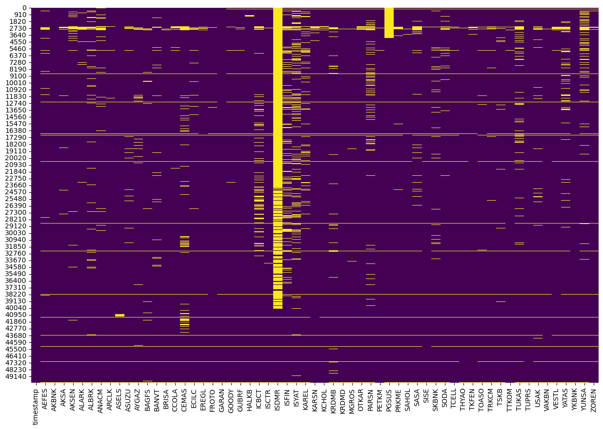
    


```python
# Start understanding structure 3 - missing values - lets fill the values by interpolating and update parsed version as well
df = df.interpolate(method='linear', axis=0)
parsed_timestamp_df = df.drop(df.columns[0], axis = 1)
nan_matrix = df.isnull()
plt.figure(figsize=(15,10))
sns.heatmap(nan_matrix, cbar=False, cmap='viridis')
plt.show()
```


    
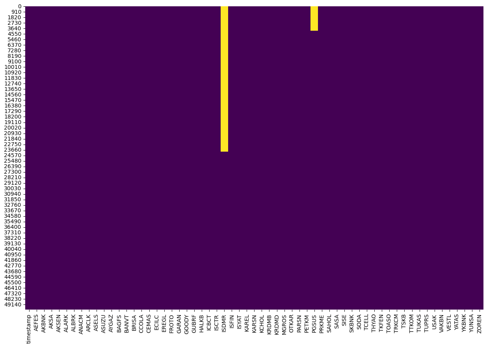
    


```python
# Start understanding distribution - summary statistics and histograms
display(df.describe())
df.hist(figsize=(20,15))
plt.tight_layout()
plt.show()
```


<div>
<style scoped>
    .dataframe tbody tr th:only-of-type {
        vertical-align: middle;
    }

    .dataframe tbody tr th {
        vertical-align: top;
    }

    .dataframe thead th {
        text-align: right;
    }
</style>
<table border="1" class="dataframe">
  <thead>
    <tr style="text-align: right;">
      <th></th>
      <th>AEFES</th>
      <th>AKBNK</th>
      <th>AKSA</th>
      <th>AKSEN</th>
      <th>ALARK</th>
      <th>ALBRK</th>
      <th>ANACM</th>
      <th>ARCLK</th>
      <th>ASELS</th>
      <th>ASUZU</th>
      <th>AYGAZ</th>
      <th>BAGFS</th>
      <th>BANVT</th>
      <th>BRISA</th>
      <th>CCOLA</th>
      <th>CEMAS</th>
      <th>ECILC</th>
      <th>EREGL</th>
      <th>FROTO</th>
      <th>GARAN</th>
      <th>GOODY</th>
      <th>GUBRF</th>
      <th>HALKB</th>
      <th>ICBCT</th>
      <th>ISCTR</th>
      <th>ISDMR</th>
      <th>ISFIN</th>
      <th>ISYAT</th>
      <th>KAREL</th>
      <th>KARSN</th>
      <th>KCHOL</th>
      <th>KRDMB</th>
      <th>KRDMD</th>
      <th>MGROS</th>
      <th>OTKAR</th>
      <th>PARSN</th>
      <th>PETKM</th>
      <th>PGSUS</th>
      <th>PRKME</th>
      <th>SAHOL</th>
      <th>SASA</th>
      <th>SISE</th>
      <th>SKBNK</th>
      <th>SODA</th>
      <th>TCELL</th>
      <th>THYAO</th>
      <th>TKFEN</th>
      <th>TOASO</th>
      <th>TRKCM</th>
      <th>TSKB</th>
      <th>TTKOM</th>
      <th>TUKAS</th>
      <th>TUPRS</th>
      <th>USAK</th>
      <th>VAKBN</th>
      <th>VESTL</th>
      <th>YATAS</th>
      <th>YKBNK</th>
      <th>YUNSA</th>
      <th>ZOREN</th>
    </tr>
  </thead>
  <tbody>
    <tr>
      <th>count</th>
      <td>50012.000000</td>
      <td>50012.000000</td>
      <td>50012.000000</td>
      <td>50012.000000</td>
      <td>50012.000000</td>
      <td>50012.000000</td>
      <td>50012.000000</td>
      <td>50012.000000</td>
      <td>50012.000000</td>
      <td>50012.000000</td>
      <td>50012.000000</td>
      <td>50012.000000</td>
      <td>50012.000000</td>
      <td>50012.000000</td>
      <td>50012.000000</td>
      <td>50012.000000</td>
      <td>50012.000000</td>
      <td>50012.000000</td>
      <td>50012.000000</td>
      <td>50012.000000</td>
      <td>50012.000000</td>
      <td>50012.000000</td>
      <td>50012.000000</td>
      <td>50012.000000</td>
      <td>50012.000000</td>
      <td>26057.000000</td>
      <td>50012.000000</td>
      <td>50012.000000</td>
      <td>50012.000000</td>
      <td>50012.000000</td>
      <td>50012.000000</td>
      <td>50012.000000</td>
      <td>50012.000000</td>
      <td>50012.000000</td>
      <td>50012.000000</td>
      <td>50012.000000</td>
      <td>50012.000000</td>
      <td>46015.000000</td>
      <td>50012.000000</td>
      <td>50012.000000</td>
      <td>50012.000000</td>
      <td>50012.000000</td>
      <td>50012.000000</td>
      <td>50012.000000</td>
      <td>50012.000000</td>
      <td>50012.000000</td>
      <td>50012.000000</td>
      <td>50012.000000</td>
      <td>50012.000000</td>
      <td>50012.000000</td>
      <td>50012.000000</td>
      <td>50012.000000</td>
      <td>50012.000000</td>
      <td>50012.000000</td>
      <td>50012.000000</td>
      <td>50012.000000</td>
      <td>50012.000000</td>
      <td>50012.000000</td>
      <td>50012.000000</td>
      <td>50012.000000</td>
    </tr>
    <tr>
      <th>mean</th>
      <td>20.999765</td>
      <td>6.473033</td>
      <td>7.098991</td>
      <td>3.198649</td>
      <td>2.058960</td>
      <td>1.366489</td>
      <td>1.665100</td>
      <td>15.374719</td>
      <td>13.521743</td>
      <td>6.450174</td>
      <td>8.066140</td>
      <td>10.392947</td>
      <td>7.585731</td>
      <td>6.546420</td>
      <td>36.879707</td>
      <td>1.220327</td>
      <td>2.064860</td>
      <td>4.190049</td>
      <td>32.753425</td>
      <td>7.902257</td>
      <td>3.101909</td>
      <td>4.326464</td>
      <td>10.916680</td>
      <td>2.727475</td>
      <td>5.129005</td>
      <td>3.867774</td>
      <td>1.457677</td>
      <td>0.525442</td>
      <td>3.088948</td>
      <td>1.324861</td>
      <td>12.247970</td>
      <td>2.207865</td>
      <td>1.769405</td>
      <td>19.577136</td>
      <td>81.128430</td>
      <td>7.994128</td>
      <td>2.541587</td>
      <td>24.806137</td>
      <td>2.933022</td>
      <td>8.614563</td>
      <td>2.249260</td>
      <td>3.051637</td>
      <td>1.478175</td>
      <td>3.151714</td>
      <td>9.831372</td>
      <td>9.302941</td>
      <td>9.195998</td>
      <td>16.558826</td>
      <td>2.025407</td>
      <td>0.945122</td>
      <td>5.658767</td>
      <td>1.706822</td>
      <td>63.064551</td>
      <td>1.213295</td>
      <td>4.735101</td>
      <td>5.917606</td>
      <td>2.313140</td>
      <td>2.565365</td>
      <td>4.045200</td>
      <td>1.246740</td>
    </tr>
    <tr>
      <th>std</th>
      <td>2.487804</td>
      <td>0.944306</td>
      <td>2.721361</td>
      <td>0.735249</td>
      <td>0.573195</td>
      <td>0.167572</td>
      <td>0.785623</td>
      <td>4.533101</td>
      <td>9.618629</td>
      <td>2.192312</td>
      <td>2.608643</td>
      <td>3.604752</td>
      <td>6.240489</td>
      <td>1.294799</td>
      <td>6.735998</td>
      <td>0.799952</td>
      <td>0.973493</td>
      <td>2.693558</td>
      <td>14.762311</td>
      <td>1.249090</td>
      <td>0.892034</td>
      <td>1.224316</td>
      <td>3.070512</td>
      <td>1.741387</td>
      <td>1.004176</td>
      <td>2.038660</td>
      <td>1.683149</td>
      <td>0.158571</td>
      <td>2.104433</td>
      <td>0.289648</td>
      <td>3.182249</td>
      <td>0.688680</td>
      <td>0.940351</td>
      <td>3.898629</td>
      <td>27.990962</td>
      <td>4.650927</td>
      <td>1.378543</td>
      <td>7.649953</td>
      <td>0.723832</td>
      <td>0.954221</td>
      <td>2.480564</td>
      <td>1.425571</td>
      <td>0.294379</td>
      <td>2.058252</td>
      <td>2.359280</td>
      <td>4.030324</td>
      <td>6.676604</td>
      <td>6.338753</td>
      <td>1.101318</td>
      <td>0.154439</td>
      <td>0.819881</td>
      <td>0.859530</td>
      <td>32.441403</td>
      <td>0.457364</td>
      <td>0.977634</td>
      <td>2.842267</td>
      <td>2.522167</td>
      <td>0.423269</td>
      <td>1.328115</td>
      <td>0.310956</td>
    </tr>
    <tr>
      <th>min</th>
      <td>0.000100</td>
      <td>0.000100</td>
      <td>0.000100</td>
      <td>0.000000</td>
      <td>0.000100</td>
      <td>1.025500</td>
      <td>0.000100</td>
      <td>0.000100</td>
      <td>0.000100</td>
      <td>0.000100</td>
      <td>0.000100</td>
      <td>0.000100</td>
      <td>0.000000</td>
      <td>0.000100</td>
      <td>0.000100</td>
      <td>0.000000</td>
      <td>0.000100</td>
      <td>0.000100</td>
      <td>0.000100</td>
      <td>0.000100</td>
      <td>0.000100</td>
      <td>0.000100</td>
      <td>0.000100</td>
      <td>0.000000</td>
      <td>0.000100</td>
      <td>1.018100</td>
      <td>0.000100</td>
      <td>0.000100</td>
      <td>0.000100</td>
      <td>0.000100</td>
      <td>0.000100</td>
      <td>0.000100</td>
      <td>0.000100</td>
      <td>0.000100</td>
      <td>0.000100</td>
      <td>0.000000</td>
      <td>0.000100</td>
      <td>0.000000</td>
      <td>0.000100</td>
      <td>0.000100</td>
      <td>0.000100</td>
      <td>0.000100</td>
      <td>0.000100</td>
      <td>0.000100</td>
      <td>0.000100</td>
      <td>0.000100</td>
      <td>0.000100</td>
      <td>0.000100</td>
      <td>0.000100</td>
      <td>0.000100</td>
      <td>0.000100</td>
      <td>0.650000</td>
      <td>0.000100</td>
      <td>0.000100</td>
      <td>0.000100</td>
      <td>0.000000</td>
      <td>0.000100</td>
      <td>0.000100</td>
      <td>0.000100</td>
      <td>0.000100</td>
    </tr>
    <tr>
      <th>25%</th>
      <td>19.178300</td>
      <td>5.850000</td>
      <td>5.183100</td>
      <td>2.680000</td>
      <td>1.569200</td>
      <td>1.230000</td>
      <td>1.047000</td>
      <td>11.711100</td>
      <td>4.986900</td>
      <td>5.067400</td>
      <td>5.922600</td>
      <td>8.224100</td>
      <td>2.580000</td>
      <td>5.893800</td>
      <td>31.978200</td>
      <td>0.700000</td>
      <td>1.166200</td>
      <td>2.201800</td>
      <td>21.417900</td>
      <td>7.020000</td>
      <td>2.427300</td>
      <td>3.276500</td>
      <td>8.710900</td>
      <td>1.540000</td>
      <td>4.321900</td>
      <td>1.804737</td>
      <td>0.563900</td>
      <td>0.436800</td>
      <td>1.522000</td>
      <td>1.104500</td>
      <td>9.736800</td>
      <td>1.542400</td>
      <td>1.084500</td>
      <td>16.670000</td>
      <td>56.557300</td>
      <td>4.490000</td>
      <td>1.286900</td>
      <td>17.800000</td>
      <td>2.390000</td>
      <td>7.965200</td>
      <td>0.314400</td>
      <td>1.922000</td>
      <td>1.200000</td>
      <td>1.436200</td>
      <td>8.566300</td>
      <td>6.436400</td>
      <td>4.327500</td>
      <td>10.327200</td>
      <td>1.169400</td>
      <td>0.825400</td>
      <td>5.265900</td>
      <td>1.030000</td>
      <td>34.549100</td>
      <td>0.949000</td>
      <td>4.030000</td>
      <td>3.950000</td>
      <td>0.340000</td>
      <td>2.268200</td>
      <td>2.882700</td>
      <td>1.026800</td>
    </tr>
    <tr>
      <th>50%</th>
      <td>20.671000</td>
      <td>6.302300</td>
      <td>6.978400</td>
      <td>2.940000</td>
      <td>1.937063</td>
      <td>1.363300</td>
      <td>1.254900</td>
      <td>14.986900</td>
      <td>9.304250</td>
      <td>5.930000</td>
      <td>7.695400</td>
      <td>10.610000</td>
      <td>3.700000</td>
      <td>6.730000</td>
      <td>34.840300</td>
      <td>0.890000</td>
      <td>1.803600</td>
      <td>3.037900</td>
      <td>27.108500</td>
      <td>7.659900</td>
      <td>3.186100</td>
      <td>4.247800</td>
      <td>10.655900</td>
      <td>2.000000</td>
      <td>4.860000</td>
      <td>3.170637</td>
      <td>0.732400</td>
      <td>0.483400</td>
      <td>1.800500</td>
      <td>1.280000</td>
      <td>12.035600</td>
      <td>2.181300</td>
      <td>1.397900</td>
      <td>19.140000</td>
      <td>82.543000</td>
      <td>7.710000</td>
      <td>2.285900</td>
      <td>25.650000</td>
      <td>2.745200</td>
      <td>8.607900</td>
      <td>0.640600</td>
      <td>2.668200</td>
      <td>1.520000</td>
      <td>2.652400</td>
      <td>9.700100</td>
      <td>7.780000</td>
      <td>5.736300</td>
      <td>16.506400</td>
      <td>1.625900</td>
      <td>0.937400</td>
      <td>5.740000</td>
      <td>1.520000</td>
      <td>49.554200</td>
      <td>1.046300</td>
      <td>4.480000</td>
      <td>6.300000</td>
      <td>0.905800</td>
      <td>2.609300</td>
      <td>4.084800</td>
      <td>1.250000</td>
    </tr>
    <tr>
      <th>75%</th>
      <td>22.732000</td>
      <td>6.931900</td>
      <td>8.690000</td>
      <td>3.790000</td>
      <td>2.409500</td>
      <td>1.500900</td>
      <td>2.387400</td>
      <td>19.068900</td>
      <td>22.816600</td>
      <td>7.090000</td>
      <td>10.225100</td>
      <td>12.340000</td>
      <td>11.910000</td>
      <td>7.330000</td>
      <td>42.004100</td>
      <td>1.530000</td>
      <td>2.763200</td>
      <td>6.806000</td>
      <td>48.556500</td>
      <td>8.680000</td>
      <td>3.595700</td>
      <td>5.124900</td>
      <td>13.490900</td>
      <td>3.711250</td>
      <td>5.826500</td>
      <td>5.920000</td>
      <td>1.384300</td>
      <td>0.613300</td>
      <td>5.150000</td>
      <td>1.470000</td>
      <td>15.169300</td>
      <td>2.722500</td>
      <td>2.169000</td>
      <td>22.100000</td>
      <td>105.300000</td>
      <td>10.510000</td>
      <td>3.882800</td>
      <td>29.440000</td>
      <td>3.462300</td>
      <td>9.265200</td>
      <td>4.845900</td>
      <td>4.155400</td>
      <td>1.720700</td>
      <td>4.277900</td>
      <td>11.245200</td>
      <td>12.300000</td>
      <td>14.258400</td>
      <td>20.614600</td>
      <td>2.982600</td>
      <td>1.024400</td>
      <td>6.260000</td>
      <td>2.110000</td>
      <td>93.496650</td>
      <td>1.354600</td>
      <td>5.240700</td>
      <td>7.440000</td>
      <td>4.060000</td>
      <td>2.874000</td>
      <td>4.672800</td>
      <td>1.426500</td>
    </tr>
    <tr>
      <th>max</th>
      <td>28.509000</td>
      <td>9.212400</td>
      <td>15.118900</td>
      <td>5.190000</td>
      <td>3.514300</td>
      <td>2.190000</td>
      <td>3.502100</td>
      <td>26.427800</td>
      <td>46.761600</td>
      <td>15.280000</td>
      <td>13.593500</td>
      <td>38.435200</td>
      <td>28.680000</td>
      <td>10.327500</td>
      <td>54.220800</td>
      <td>7.010000</td>
      <td>4.227800</td>
      <td>10.471000</td>
      <td>65.419200</td>
      <td>12.155400</td>
      <td>58.757400</td>
      <td>13.619100</td>
      <td>20.236500</td>
      <td>11.270000</td>
      <td>7.963900</td>
      <td>7.593600</td>
      <td>9.830000</td>
      <td>1.150000</td>
      <td>9.460000</td>
      <td>2.500000</td>
      <td>19.150000</td>
      <td>4.496000</td>
      <td>4.951000</td>
      <td>30.260000</td>
      <td>139.428800</td>
      <td>29.820000</td>
      <td>5.769700</td>
      <td>50.650000</td>
      <td>5.430000</td>
      <td>11.682600</td>
      <td>8.426000</td>
      <td>6.923000</td>
      <td>2.251600</td>
      <td>7.765900</td>
      <td>15.812500</td>
      <td>19.950000</td>
      <td>27.320000</td>
      <td>29.921800</td>
      <td>4.643200</td>
      <td>1.420800</td>
      <td>7.350000</td>
      <td>5.920000</td>
      <td>139.293700</td>
      <td>2.757800</td>
      <td>7.581400</td>
      <td>14.540000</td>
      <td>10.674800</td>
      <td>3.958100</td>
      <td>9.527500</td>
      <td>2.443000</td>
    </tr>
  </tbody>
</table>
</div>


    
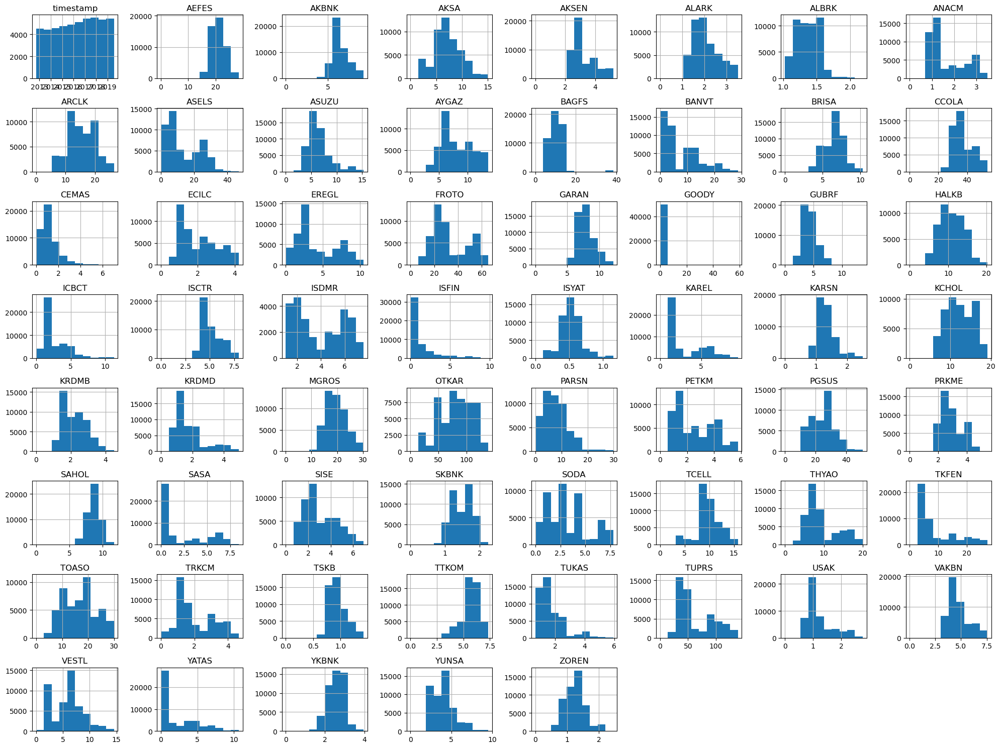
    


```python
# Start understanding distribution - boxplots
plt.figure(figsize=(20,10))
sns.boxplot(data=df.iloc[:, 1:]) # if timestamp is the first column, exclude it
plt.xticks(rotation=90)
plt.show()
```


    
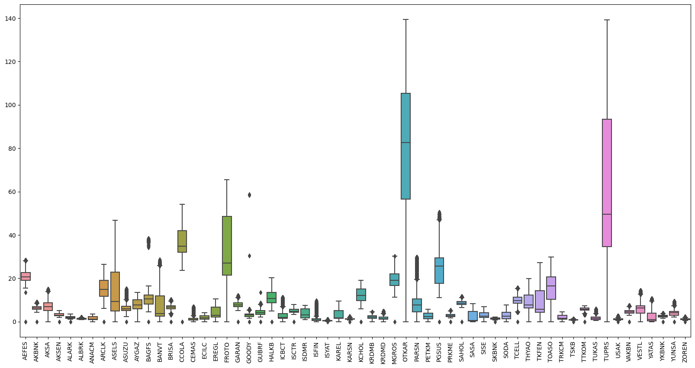
    


```python
# We have some minimum values that are equal to zero. lets keep that in mind when we select stocks
# Start understanding patterns - time series
plt.figure(figsize=(20,10))
for column in df.columns[1:]:
    plt.plot(df['timestamp'], df[column], label=column)
plt.legend()
plt.show()
```

    /opt/conda/envs/anaconda-panel-2023.05-py310/lib/python3.11/site-packages/IPython/core/pylabtools.py:152: UserWarning: Creating legend with loc="best" can be slow with large amounts of data.
      fig.canvas.print_figure(bytes_io, **kw)


    
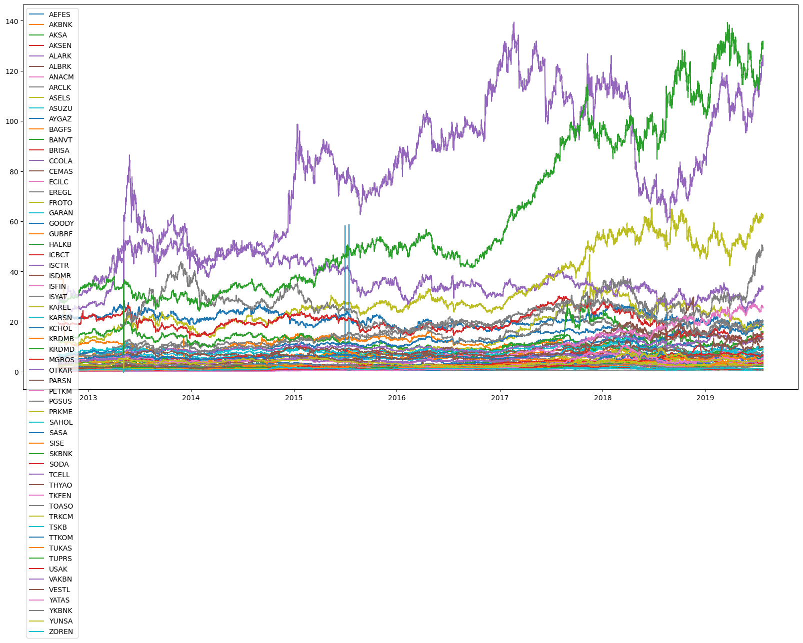
    


```python
# we have some minimum values that are equal to zero. lets keep that in time
# Start understanding patterns - correlation matrix
correlation_matrix = df.corr()
plt.figure(figsize=(20,15))
sns.heatmap(correlation_matrix, annot=True, cmap='coolwarm', linewidths=.5)
plt.show()
```


    
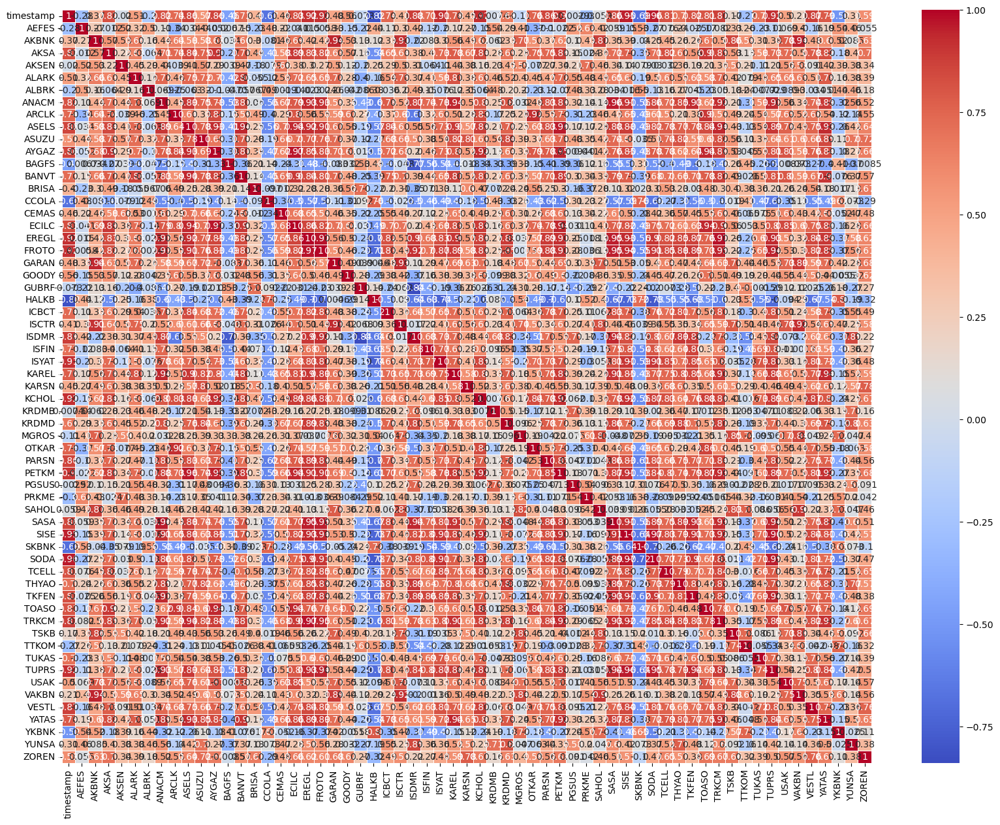
    


```python
# let me select 12 stocks from various industries, in some cases multiple stocks from the same industry
# I want to see what kind of results PCA gives with correlated and uncorrelated stocks
# Moving correlation - stock selection
stock_names = ['GARAN', 'AKBNK', 'YKBNK', 'TCELL', 'TTKOM', 'KRDMD', 'EREGL', 'PETKM', 'TUPRS', 'VESTL']
selected_stocks = df[stock_names]
print(selected_stocks)
```

            GARAN   AKBNK   YKBNK    TCELL   TTKOM   KRDMD   EREGL   PETKM  \
    0      6.3715  5.2084  2.5438   4.5359  4.2639  0.7165  0.7914  0.7866   
    1      6.3386  5.1938  2.5266   4.5153  4.2521  0.7165  0.7844  0.7829   
    2      6.3386  5.2084  2.5266   4.5153  4.2521  0.7165  0.7914  0.7903   
    3      6.3715  5.1938  2.5324   4.5359  4.2521  0.7104  0.7914  0.7903   
    4      6.3715  5.2084  2.5324   4.5153  4.2521  0.7104  0.7914  0.7941   
    ...       ...     ...     ...      ...     ...     ...     ...     ...   
    50007  9.8500  7.7300  2.7500  13.4500  5.6000  2.2800  7.6900  4.1000   
    50008  9.8600  7.7200  2.7500  13.4300  5.5700  2.2800  7.6500  4.1000   
    50009  9.8600  7.7400  2.7600  13.4600  5.5700  2.2800  7.6700  4.1000   
    50010  9.8400  7.7000  2.7700  13.4300  5.5700  2.2800  7.6700  4.0900   
    50011  9.8300  7.7000  2.7700  13.4000  5.5600  2.2700  7.6700  4.0900   
    
              TUPRS  VESTL  
    0       29.8072   1.90  
    1       29.7393   1.90  
    2       29.6716   1.91  
    3       29.7393   1.91  
    4       29.8072   1.90  
    ...         ...    ...  
    50007  131.6000   9.98  
    50008  131.5000   9.98  
    50009  131.5000   9.96  
    50010  131.3000   9.94  
    50011  131.8000   9.93  
    
    [50012 rows x 10 columns]


```python
# Moving correlation - window selection - 7 hours in a day, 22 days in a month = 616 ~ used 600
window_size = 600
# Moving correlation - calculation
rolling_correlations = selected_stocks.rolling(window=window_size).corr(pairwise=True)
# Moving correlation - three point in time, beginning, some middle point and end
time_points = rolling_correlations.index.get_level_values(0).unique()
beginning = time_points[window_size*3]
middle = time_points[len(unique_time_points) // 2]
end = time_points[-1]

def plot_heatmap(time_point):
    corr_matrix = rolling_correlations.xs(time_point, level=0)
    plt.figure(figsize=(10, 8))
    sns.heatmap(corr_matrix, annot=True, cmap="coolwarm", vmin=-1, vmax=1)
    plt.title(f"Correlations at time point {time_point}")
    plt.show()

plot_heatmap(beginning) 
plot_heatmap(middle)  
plot_heatmap(end)   


```


    
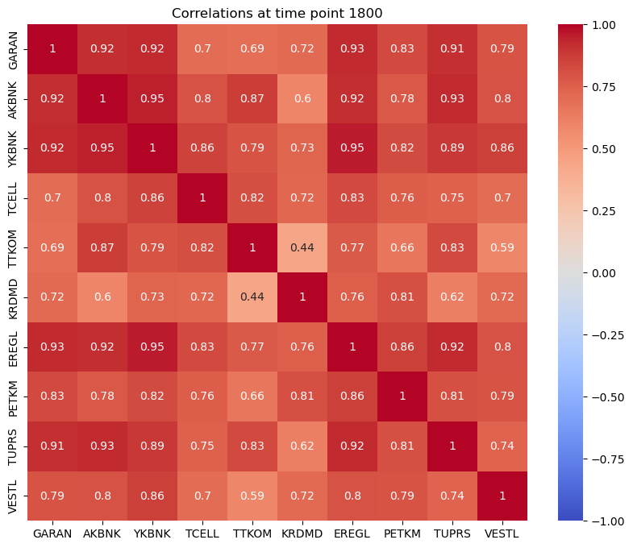
    


    
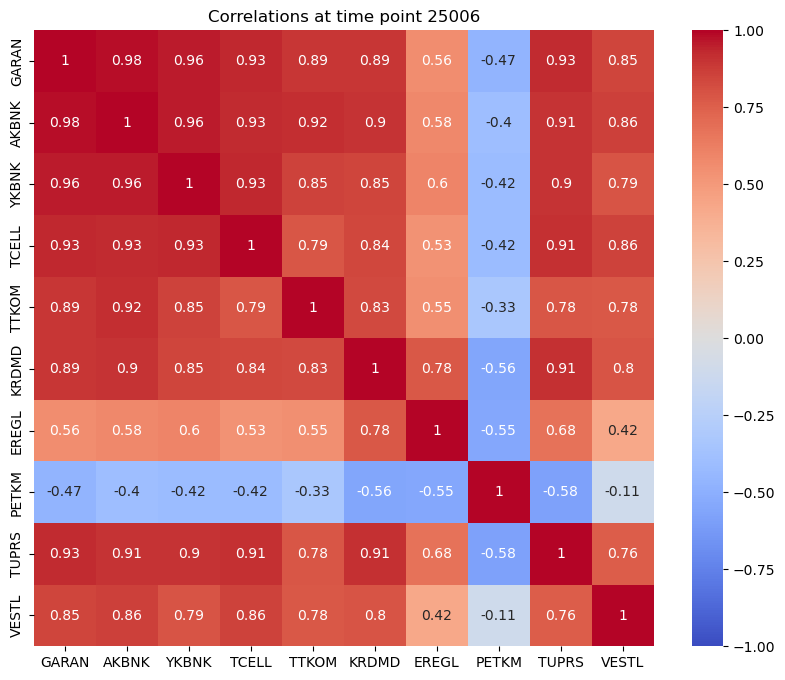
    


    
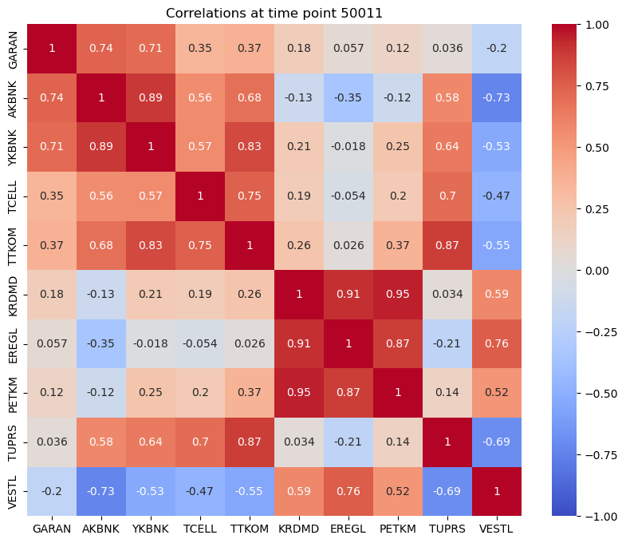
    


```python
# For the stocks in the same industry correlation varied however it is limited.
# For example look at (Garan, Akbnk, Ykbnk) or (Krdmd, Eregl)
# For the stocks not in the same industry correlation varied significantly
# For example look at (Tuprs, Asels)
# Now I am curious to see a timeseries to see changes over time
# garan and akbnk combination over time:
rolling_corr_garan_akbnk = rolling_correlations.loc[pd.IndexSlice[:, 'GARAN'], 'AKBNK']
plt.figure(figsize=(14,7))
rolling_corr_garan_akbnk.plot()
plt.title("Rolling Correlation Between GARAN and AKBNK")
plt.xlabel("Date")
plt.ylabel("Correlation")
plt.grid(True)
plt.tight_layout()
plt.show()
# bagfs and gubrf combination over time:
rolling_corr_krdmd_eregl = rolling_correlations.loc[pd.IndexSlice[:, 'KRDMD'], 'EREGL']
plt.figure(figsize=(14,7))
rolling_corr_krdmd_eregl.plot()
plt.title("Rolling Correlation Between KRDMD and EREGL")
plt.xlabel("Date")
plt.ylabel("Correlation")
plt.grid(True)
plt.tight_layout()
plt.show()
# tuprs and asels combination over time:
rolling_corr_tuprs_vestl = rolling_correlations.loc[pd.IndexSlice[:, 'TUPRS'], 'VESTL']
plt.figure(figsize=(14,7))
rolling_corr_tuprs_vestl.plot()
plt.title("Rolling Correlation Between TUPRS and VESTL")
plt.xlabel("Date")
plt.ylabel("Correlation")
plt.grid(True)
plt.tight_layout()
plt.show()
```


    
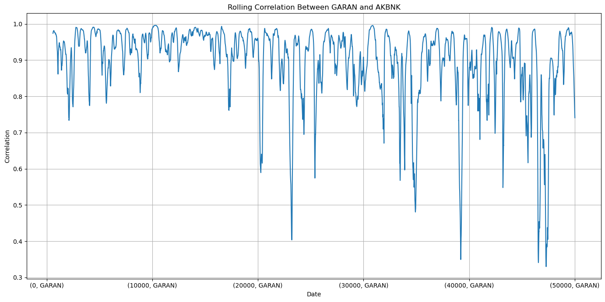
    


    
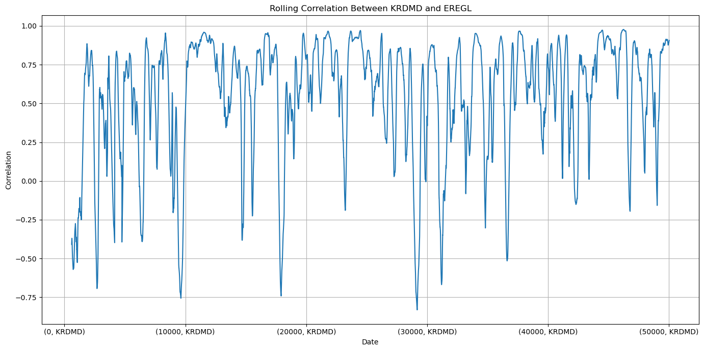
    


    
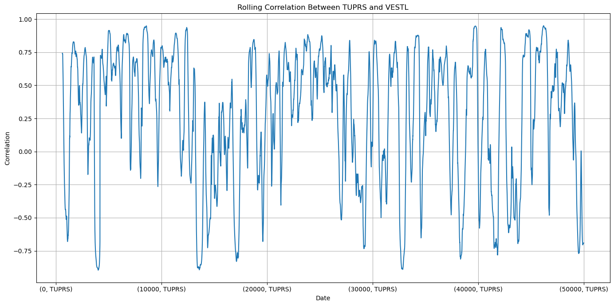
    


```python
# correlation in banking is a bit tighter
# correlation in industrial is a bit loose
# still we see extreme highs and lows for stocks, even if they are in the same industry
# somehow we need to make data stationary.
# let me take time difference of stocks to ensure stationarity and do the analysis above again
differenced_stocks = selected_stocks.diff().dropna()
rolling_correlations = differenced_stocks.rolling(window=window_size).corr(pairwise=True)
plot_heatmap(beginning) 
plot_heatmap(middle)  
plot_heatmap(end) 
```


    
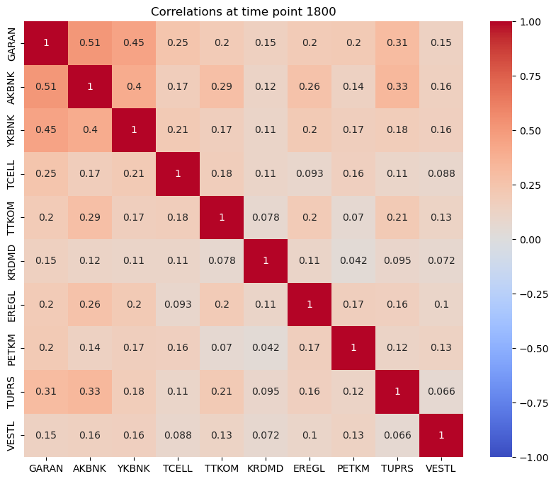
    


    
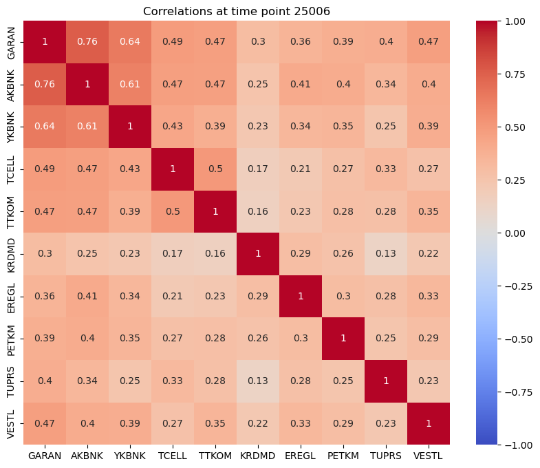
    


    
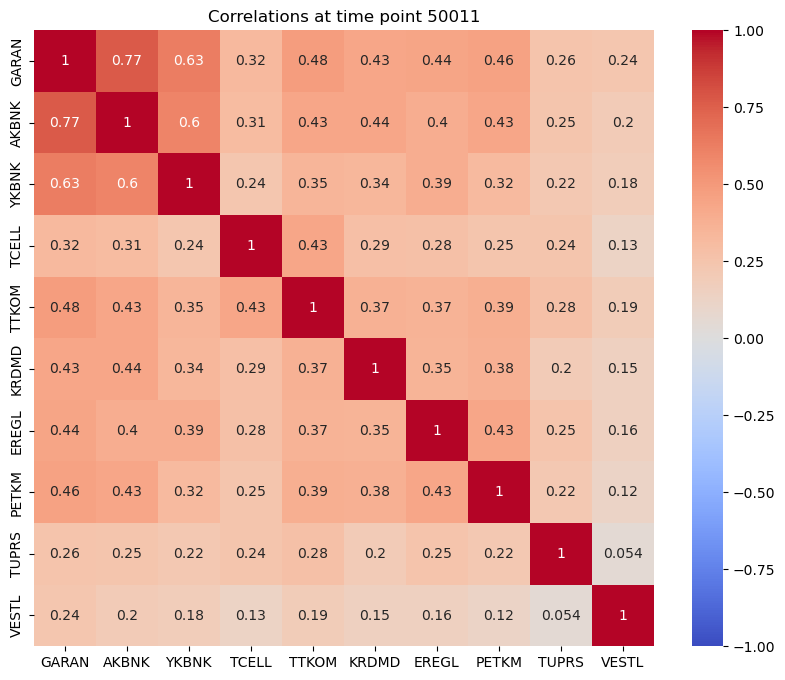
    


```python
# let me look at time series to check stationarity
# garan and akbnk combination over time: 
rolling_corr_garan_akbnk = rolling_correlations.loc[pd.IndexSlice[:, 'GARAN'], 'AKBNK']
plt.figure(figsize=(14,7))
rolling_corr_garan_akbnk.plot()
plt.title("Rolling Correlation Between GARAN and AKBNK")
plt.xlabel("Date")
plt.ylabel("Correlation")
plt.grid(True)
plt.tight_layout()
plt.show()
# krdmd and eregl combination over time:
rolling_corr_krdmd_eregl = rolling_correlations.loc[pd.IndexSlice[:, 'KRDMD'], 'EREGL']
plt.figure(figsize=(14,7))
rolling_corr_krdmd_eregl.plot()
plt.title("Rolling Correlation Between KRDMD and EREGL")
plt.xlabel("Date")
plt.ylabel("Correlation")
plt.grid(True)
plt.tight_layout()
plt.show()
# tuprs and vestl combination over time:
rolling_corr_tuprs_vestl = rolling_correlations.loc[pd.IndexSlice[:, 'TUPRS'], 'VESTL']
plt.figure(figsize=(14,7))
rolling_corr_tuprs_vestl.plot()
plt.title("Rolling Correlation Between TUPRS and VESTL")
plt.xlabel("Date")
plt.ylabel("Correlation")
plt.grid(True)
plt.tight_layout()
plt.show()
```


    
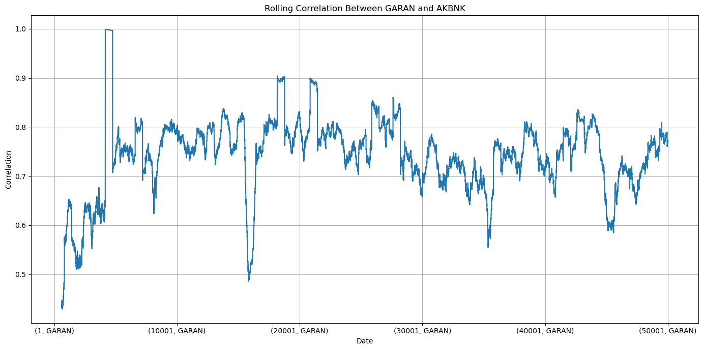
    


    
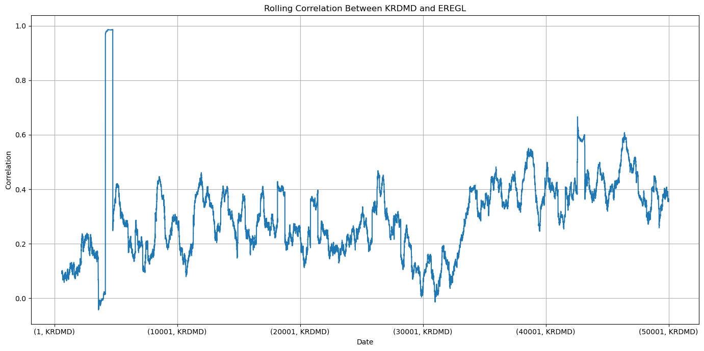
    


    
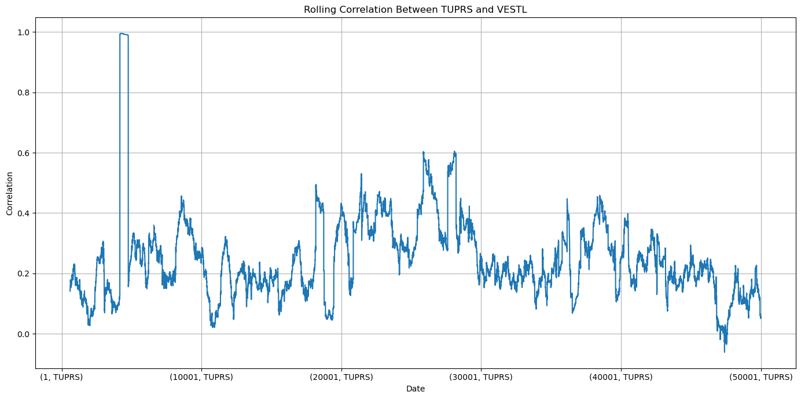
    


```python
# Looks more stationary now
# Calculate correlation matrix
correlation_matrix = differenced_stocks.corr()
display(correlation_matrix)
```


<div>
<style scoped>
    .dataframe tbody tr th:only-of-type {
        vertical-align: middle;
    }

    .dataframe tbody tr th {
        vertical-align: top;
    }

    .dataframe thead th {
        text-align: right;
    }
</style>
<table border="1" class="dataframe">
  <thead>
    <tr style="text-align: right;">
      <th></th>
      <th>GARAN</th>
      <th>AKBNK</th>
      <th>YKBNK</th>
      <th>TCELL</th>
      <th>TTKOM</th>
      <th>KRDMD</th>
      <th>EREGL</th>
      <th>PETKM</th>
      <th>TUPRS</th>
      <th>VESTL</th>
    </tr>
  </thead>
  <tbody>
    <tr>
      <th>GARAN</th>
      <td>1.000000</td>
      <td>0.949921</td>
      <td>0.927242</td>
      <td>0.764507</td>
      <td>0.876966</td>
      <td>0.666391</td>
      <td>0.396921</td>
      <td>0.655919</td>
      <td>0.705607</td>
      <td>0.451847</td>
    </tr>
    <tr>
      <th>AKBNK</th>
      <td>0.949921</td>
      <td>1.000000</td>
      <td>0.926040</td>
      <td>0.766739</td>
      <td>0.879081</td>
      <td>0.656685</td>
      <td>0.390477</td>
      <td>0.648716</td>
      <td>0.704287</td>
      <td>0.443262</td>
    </tr>
    <tr>
      <th>YKBNK</th>
      <td>0.927242</td>
      <td>0.926040</td>
      <td>1.000000</td>
      <td>0.755685</td>
      <td>0.872589</td>
      <td>0.638565</td>
      <td>0.368674</td>
      <td>0.627574</td>
      <td>0.693180</td>
      <td>0.425791</td>
    </tr>
    <tr>
      <th>TCELL</th>
      <td>0.764507</td>
      <td>0.766739</td>
      <td>0.755685</td>
      <td>1.000000</td>
      <td>0.739447</td>
      <td>0.549194</td>
      <td>0.364994</td>
      <td>0.549361</td>
      <td>0.599329</td>
      <td>0.371744</td>
    </tr>
    <tr>
      <th>TTKOM</th>
      <td>0.876966</td>
      <td>0.879081</td>
      <td>0.872589</td>
      <td>0.739447</td>
      <td>1.000000</td>
      <td>0.610872</td>
      <td>0.357068</td>
      <td>0.603661</td>
      <td>0.675198</td>
      <td>0.403853</td>
    </tr>
    <tr>
      <th>KRDMD</th>
      <td>0.666391</td>
      <td>0.656685</td>
      <td>0.638565</td>
      <td>0.549194</td>
      <td>0.610872</td>
      <td>1.000000</td>
      <td>0.455818</td>
      <td>0.569310</td>
      <td>0.533062</td>
      <td>0.393900</td>
    </tr>
    <tr>
      <th>EREGL</th>
      <td>0.396921</td>
      <td>0.390477</td>
      <td>0.368674</td>
      <td>0.364994</td>
      <td>0.357068</td>
      <td>0.455818</td>
      <td>1.000000</td>
      <td>0.420360</td>
      <td>0.365844</td>
      <td>0.305980</td>
    </tr>
    <tr>
      <th>PETKM</th>
      <td>0.655919</td>
      <td>0.648716</td>
      <td>0.627574</td>
      <td>0.549361</td>
      <td>0.603661</td>
      <td>0.569310</td>
      <td>0.420360</td>
      <td>1.000000</td>
      <td>0.531551</td>
      <td>0.402220</td>
    </tr>
    <tr>
      <th>TUPRS</th>
      <td>0.705607</td>
      <td>0.704287</td>
      <td>0.693180</td>
      <td>0.599329</td>
      <td>0.675198</td>
      <td>0.533062</td>
      <td>0.365844</td>
      <td>0.531551</td>
      <td>1.000000</td>
      <td>0.364741</td>
    </tr>
    <tr>
      <th>VESTL</th>
      <td>0.451847</td>
      <td>0.443262</td>
      <td>0.425791</td>
      <td>0.371744</td>
      <td>0.403853</td>
      <td>0.393900</td>
      <td>0.305980</td>
      <td>0.402220</td>
      <td>0.364741</td>
      <td>1.000000</td>
    </tr>
  </tbody>
</table>
</div>


```python
# Calculate correlation matrix
pca = PCA()
pca.fit(correlation_matrix)
explained_variance = pca.explained_variance_ratio_
plt.figure(figsize=(10, 6))
plt.bar(range(1, len(explained_variance) + 1), explained_variance, alpha=0.5, align='center', label='Individual explained variance')
plt.ylabel('Explained variance ratio')
plt.xlabel('Principal components')
plt.legend(loc='best')
plt.tight_layout()
plt.show()
plt.figure(figsize=(10, 6))
plt.step(range(1, len(explained_variance) + 1), explained_variance.cumsum(), where='mid', label='Cumulative explained variance')
plt.ylabel('Cumulative explained variance ratio')
plt.xlabel('Principal components')
plt.legend(loc='best')
plt.tight_layout()
plt.show()
```


    
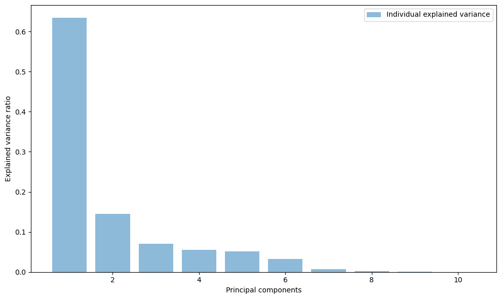
    


    
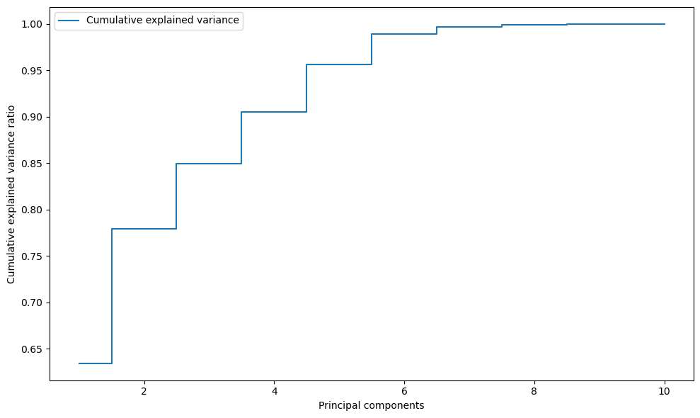
    


```python
# Aiming to capture 95% of the variance so going to move with 5 components
components = 5
pca_opt = PCA(components)
principal_components = pca_opt.fit_transform(correlation_matrix)
pc_df = pd.DataFrame(data=principal_components, columns=[f"Principal Component {i}" for i in range(1, components + 1)])
explained_variance = pca_opt.explained_variance_ratio_
print(f"Explained variance for each component: {explained_variance}")
print(pc_df)
```

    Explained variance for each component: [0.63412451 0.14506967 0.07051866 0.05570385 0.05113044]
       Principal Component 1  Principal Component 2  Principal Component 3  \
    0              -0.446413               0.013542               0.003487   
    1              -0.448004               0.013773              -0.006821   
    2              -0.432381               0.020839              -0.022524   
    3              -0.182885              -0.004732              -0.130479   
    4              -0.379656               0.018568              -0.047819   
    5               0.137701              -0.130967               0.241272   
    6               0.899229              -0.408735              -0.143855   
    7               0.144749              -0.061917               0.323292   
    8              -0.047919              -0.017699              -0.198764   
    9               0.755579               0.557328              -0.017789   
    
       Principal Component 4  Principal Component 5  
    0              -0.053235              -0.033266  
    1              -0.050514              -0.036664  
    2              -0.047332              -0.034605  
    3              -0.037181              -0.132515  
    4              -0.034669              -0.037627  
    5              -0.199368               0.250654  
    6              -0.055692              -0.089322  
    7               0.259676              -0.132138  
    8               0.263635               0.255519  
    9              -0.045321              -0.010035  


```python
# PCA 1 looks like seperation of banking and telecommunication sector from the rest and especially from technology
# PCA 2 looks like seperation of iron and steel sector from the rest and especially from technology
# PCA 4 looks like separation of energy sector from the rest
```


```python
# read google trends data from anaconda cloud, just first 10 rows to see if it works
# if I download more than 12 months of trends data, google trends provide the data in months, that is why I am limiting the period with 12 months
# maybe later I can pull the data through API
file_name = 'multiTimeline (3).csv'
trends = pd.read_csv(file_name, delimiter=',', skiprows=1)
trends['Week'] = pd.to_datetime(trends['Week'])
display(trends.head())

```


<div>
<style scoped>
    .dataframe tbody tr th:only-of-type {
        vertical-align: middle;
    }

    .dataframe tbody tr th {
        vertical-align: top;
    }

    .dataframe thead th {
        text-align: right;
    }
</style>
<table border="1" class="dataframe">
  <thead>
    <tr style="text-align: right;">
      <th></th>
      <th>Week</th>
      <th>tüpraş: (Türkiye)</th>
      <th>tüpraş hisse: (Türkiye)</th>
      <th>tüpraş borsa: (Türkiye)</th>
      <th>IST TUPRS: (Türkiye)</th>
      <th>TUPRS: (Türkiye)</th>
    </tr>
  </thead>
  <tbody>
    <tr>
      <th>0</th>
      <td>2018-07-29</td>
      <td>62</td>
      <td>12</td>
      <td>6</td>
      <td>0</td>
      <td>10</td>
    </tr>
    <tr>
      <th>1</th>
      <td>2018-08-05</td>
      <td>54</td>
      <td>21</td>
      <td>5</td>
      <td>0</td>
      <td>20</td>
    </tr>
    <tr>
      <th>2</th>
      <td>2018-08-12</td>
      <td>65</td>
      <td>21</td>
      <td>4</td>
      <td>1</td>
      <td>17</td>
    </tr>
    <tr>
      <th>3</th>
      <td>2018-08-19</td>
      <td>43</td>
      <td>3</td>
      <td>0</td>
      <td>0</td>
      <td>4</td>
    </tr>
    <tr>
      <th>4</th>
      <td>2018-08-26</td>
      <td>82</td>
      <td>8</td>
      <td>3</td>
      <td>3</td>
      <td>11</td>
    </tr>
  </tbody>
</table>
</div>


```python
# slices tupras yet received an error saying df might be affected, so created a copy for the slice then merged with google trends data
tupras = df[['timestamp', 'TUPRS']].copy()
tupras['timestamp'] = tupras['timestamp'].dt.tz_localize(None)
tupras.set_index('timestamp', inplace=True)
weekly_avg_tuprs = tupras.resample('W').mean().reset_index()
merged_tupras = weekly_avg_tuprs.merge(trends, left_on='timestamp', right_on='Week', how='inner')
display(merged_tupras)
```


<div>
<style scoped>
    .dataframe tbody tr th:only-of-type {
        vertical-align: middle;
    }

    .dataframe tbody tr th {
        vertical-align: top;
    }

    .dataframe thead th {
        text-align: right;
    }
</style>
<table border="1" class="dataframe">
  <thead>
    <tr style="text-align: right;">
      <th></th>
      <th>timestamp</th>
      <th>TUPRS</th>
      <th>Week</th>
      <th>tüpraş: (Türkiye)</th>
      <th>tüpraş hisse: (Türkiye)</th>
      <th>tüpraş borsa: (Türkiye)</th>
      <th>IST TUPRS: (Türkiye)</th>
      <th>TUPRS: (Türkiye)</th>
    </tr>
  </thead>
  <tbody>
    <tr>
      <th>0</th>
      <td>2018-07-29</td>
      <td>93.790785</td>
      <td>2018-07-29</td>
      <td>62</td>
      <td>12</td>
      <td>6</td>
      <td>0</td>
      <td>10</td>
    </tr>
    <tr>
      <th>1</th>
      <td>2018-08-05</td>
      <td>96.481615</td>
      <td>2018-08-05</td>
      <td>54</td>
      <td>21</td>
      <td>5</td>
      <td>0</td>
      <td>20</td>
    </tr>
    <tr>
      <th>2</th>
      <td>2018-08-12</td>
      <td>94.438693</td>
      <td>2018-08-12</td>
      <td>65</td>
      <td>21</td>
      <td>4</td>
      <td>1</td>
      <td>17</td>
    </tr>
    <tr>
      <th>3</th>
      <td>2018-08-19</td>
      <td>107.122541</td>
      <td>2018-08-19</td>
      <td>43</td>
      <td>3</td>
      <td>0</td>
      <td>0</td>
      <td>4</td>
    </tr>
    <tr>
      <th>4</th>
      <td>2018-08-26</td>
      <td>109.350308</td>
      <td>2018-08-26</td>
      <td>82</td>
      <td>8</td>
      <td>3</td>
      <td>3</td>
      <td>11</td>
    </tr>
    <tr>
      <th>5</th>
      <td>2018-09-02</td>
      <td>107.887585</td>
      <td>2018-09-02</td>
      <td>70</td>
      <td>13</td>
      <td>1</td>
      <td>0</td>
      <td>6</td>
    </tr>
    <tr>
      <th>6</th>
      <td>2018-09-09</td>
      <td>109.635110</td>
      <td>2018-09-09</td>
      <td>66</td>
      <td>14</td>
      <td>3</td>
      <td>0</td>
      <td>12</td>
    </tr>
    <tr>
      <th>7</th>
      <td>2018-09-16</td>
      <td>114.940775</td>
      <td>2018-09-16</td>
      <td>57</td>
      <td>12</td>
      <td>1</td>
      <td>1</td>
      <td>6</td>
    </tr>
    <tr>
      <th>8</th>
      <td>2018-09-23</td>
      <td>117.481858</td>
      <td>2018-09-23</td>
      <td>54</td>
      <td>16</td>
      <td>2</td>
      <td>1</td>
      <td>8</td>
    </tr>
    <tr>
      <th>9</th>
      <td>2018-09-30</td>
      <td>121.099080</td>
      <td>2018-09-30</td>
      <td>49</td>
      <td>13</td>
      <td>3</td>
      <td>0</td>
      <td>11</td>
    </tr>
    <tr>
      <th>10</th>
      <td>2018-10-07</td>
      <td>119.705243</td>
      <td>2018-10-07</td>
      <td>70</td>
      <td>14</td>
      <td>1</td>
      <td>1</td>
      <td>13</td>
    </tr>
    <tr>
      <th>11</th>
      <td>2018-10-14</td>
      <td>123.710780</td>
      <td>2018-10-14</td>
      <td>69</td>
      <td>12</td>
      <td>0</td>
      <td>0</td>
      <td>13</td>
    </tr>
    <tr>
      <th>12</th>
      <td>2018-10-21</td>
      <td>124.264020</td>
      <td>2018-10-21</td>
      <td>52</td>
      <td>9</td>
      <td>1</td>
      <td>3</td>
      <td>14</td>
    </tr>
    <tr>
      <th>13</th>
      <td>2018-10-28</td>
      <td>118.523692</td>
      <td>2018-10-28</td>
      <td>52</td>
      <td>15</td>
      <td>1</td>
      <td>1</td>
      <td>10</td>
    </tr>
    <tr>
      <th>14</th>
      <td>2018-11-04</td>
      <td>114.754028</td>
      <td>2018-11-04</td>
      <td>75</td>
      <td>18</td>
      <td>2</td>
      <td>2</td>
      <td>21</td>
    </tr>
    <tr>
      <th>15</th>
      <td>2018-11-11</td>
      <td>117.572665</td>
      <td>2018-11-11</td>
      <td>51</td>
      <td>15</td>
      <td>4</td>
      <td>1</td>
      <td>12</td>
    </tr>
    <tr>
      <th>16</th>
      <td>2018-11-18</td>
      <td>108.780285</td>
      <td>2018-11-18</td>
      <td>39</td>
      <td>13</td>
      <td>1</td>
      <td>0</td>
      <td>11</td>
    </tr>
    <tr>
      <th>17</th>
      <td>2018-11-25</td>
      <td>109.358799</td>
      <td>2018-11-25</td>
      <td>43</td>
      <td>12</td>
      <td>2</td>
      <td>0</td>
      <td>12</td>
    </tr>
    <tr>
      <th>18</th>
      <td>2018-12-02</td>
      <td>109.475294</td>
      <td>2018-12-02</td>
      <td>41</td>
      <td>11</td>
      <td>3</td>
      <td>0</td>
      <td>7</td>
    </tr>
    <tr>
      <th>19</th>
      <td>2018-12-09</td>
      <td>112.483309</td>
      <td>2018-12-09</td>
      <td>34</td>
      <td>7</td>
      <td>1</td>
      <td>1</td>
      <td>7</td>
    </tr>
    <tr>
      <th>20</th>
      <td>2018-12-16</td>
      <td>109.822307</td>
      <td>2018-12-16</td>
      <td>45</td>
      <td>12</td>
      <td>1</td>
      <td>0</td>
      <td>9</td>
    </tr>
    <tr>
      <th>21</th>
      <td>2018-12-23</td>
      <td>109.262689</td>
      <td>2018-12-23</td>
      <td>39</td>
      <td>11</td>
      <td>1</td>
      <td>0</td>
      <td>13</td>
    </tr>
    <tr>
      <th>22</th>
      <td>2018-12-30</td>
      <td>104.310698</td>
      <td>2018-12-30</td>
      <td>27</td>
      <td>6</td>
      <td>1</td>
      <td>0</td>
      <td>8</td>
    </tr>
    <tr>
      <th>23</th>
      <td>2019-01-06</td>
      <td>103.277273</td>
      <td>2019-01-06</td>
      <td>37</td>
      <td>11</td>
      <td>1</td>
      <td>3</td>
      <td>7</td>
    </tr>
    <tr>
      <th>24</th>
      <td>2019-01-13</td>
      <td>106.569909</td>
      <td>2019-01-13</td>
      <td>43</td>
      <td>15</td>
      <td>3</td>
      <td>0</td>
      <td>8</td>
    </tr>
    <tr>
      <th>25</th>
      <td>2019-01-20</td>
      <td>109.814765</td>
      <td>2019-01-20</td>
      <td>43</td>
      <td>17</td>
      <td>2</td>
      <td>0</td>
      <td>8</td>
    </tr>
    <tr>
      <th>26</th>
      <td>2019-01-27</td>
      <td>119.207547</td>
      <td>2019-01-27</td>
      <td>43</td>
      <td>14</td>
      <td>2</td>
      <td>0</td>
      <td>8</td>
    </tr>
    <tr>
      <th>27</th>
      <td>2019-02-03</td>
      <td>123.117458</td>
      <td>2019-02-03</td>
      <td>61</td>
      <td>14</td>
      <td>4</td>
      <td>2</td>
      <td>7</td>
    </tr>
    <tr>
      <th>28</th>
      <td>2019-02-10</td>
      <td>123.924902</td>
      <td>2019-02-10</td>
      <td>62</td>
      <td>17</td>
      <td>2</td>
      <td>0</td>
      <td>4</td>
    </tr>
    <tr>
      <th>29</th>
      <td>2019-02-17</td>
      <td>128.500774</td>
      <td>2019-02-17</td>
      <td>52</td>
      <td>15</td>
      <td>1</td>
      <td>1</td>
      <td>7</td>
    </tr>
    <tr>
      <th>30</th>
      <td>2019-02-24</td>
      <td>127.989770</td>
      <td>2019-02-24</td>
      <td>53</td>
      <td>13</td>
      <td>2</td>
      <td>1</td>
      <td>5</td>
    </tr>
    <tr>
      <th>31</th>
      <td>2019-03-03</td>
      <td>129.051462</td>
      <td>2019-03-03</td>
      <td>47</td>
      <td>13</td>
      <td>6</td>
      <td>0</td>
      <td>6</td>
    </tr>
    <tr>
      <th>32</th>
      <td>2019-03-10</td>
      <td>130.070409</td>
      <td>2019-03-10</td>
      <td>48</td>
      <td>13</td>
      <td>0</td>
      <td>1</td>
      <td>6</td>
    </tr>
    <tr>
      <th>33</th>
      <td>2019-03-17</td>
      <td>131.938696</td>
      <td>2019-03-17</td>
      <td>50</td>
      <td>17</td>
      <td>1</td>
      <td>0</td>
      <td>9</td>
    </tr>
    <tr>
      <th>34</th>
      <td>2019-03-24</td>
      <td>134.421098</td>
      <td>2019-03-24</td>
      <td>62</td>
      <td>24</td>
      <td>3</td>
      <td>0</td>
      <td>14</td>
    </tr>
    <tr>
      <th>35</th>
      <td>2019-03-31</td>
      <td>129.810285</td>
      <td>2019-03-31</td>
      <td>41</td>
      <td>13</td>
      <td>1</td>
      <td>0</td>
      <td>13</td>
    </tr>
    <tr>
      <th>36</th>
      <td>2019-04-07</td>
      <td>132.201572</td>
      <td>2019-04-07</td>
      <td>44</td>
      <td>16</td>
      <td>0</td>
      <td>1</td>
      <td>9</td>
    </tr>
    <tr>
      <th>37</th>
      <td>2019-04-14</td>
      <td>132.025625</td>
      <td>2019-04-14</td>
      <td>62</td>
      <td>16</td>
      <td>1</td>
      <td>0</td>
      <td>10</td>
    </tr>
    <tr>
      <th>38</th>
      <td>2019-04-21</td>
      <td>129.960000</td>
      <td>2019-04-21</td>
      <td>44</td>
      <td>13</td>
      <td>0</td>
      <td>0</td>
      <td>14</td>
    </tr>
    <tr>
      <th>39</th>
      <td>2019-04-28</td>
      <td>124.811328</td>
      <td>2019-04-28</td>
      <td>47</td>
      <td>14</td>
      <td>1</td>
      <td>1</td>
      <td>8</td>
    </tr>
    <tr>
      <th>40</th>
      <td>2019-05-05</td>
      <td>124.546484</td>
      <td>2019-05-05</td>
      <td>56</td>
      <td>19</td>
      <td>1</td>
      <td>0</td>
      <td>9</td>
    </tr>
    <tr>
      <th>41</th>
      <td>2019-05-12</td>
      <td>120.023438</td>
      <td>2019-05-12</td>
      <td>65</td>
      <td>18</td>
      <td>2</td>
      <td>0</td>
      <td>9</td>
    </tr>
    <tr>
      <th>42</th>
      <td>2019-05-19</td>
      <td>119.665723</td>
      <td>2019-05-19</td>
      <td>57</td>
      <td>13</td>
      <td>2</td>
      <td>0</td>
      <td>6</td>
    </tr>
    <tr>
      <th>43</th>
      <td>2019-05-26</td>
      <td>118.929375</td>
      <td>2019-05-26</td>
      <td>68</td>
      <td>19</td>
      <td>2</td>
      <td>0</td>
      <td>7</td>
    </tr>
    <tr>
      <th>44</th>
      <td>2019-06-02</td>
      <td>121.222813</td>
      <td>2019-06-02</td>
      <td>38</td>
      <td>7</td>
      <td>3</td>
      <td>0</td>
      <td>4</td>
    </tr>
    <tr>
      <th>45</th>
      <td>2019-06-09</td>
      <td>126.421591</td>
      <td>2019-06-09</td>
      <td>49</td>
      <td>15</td>
      <td>1</td>
      <td>0</td>
      <td>6</td>
    </tr>
    <tr>
      <th>46</th>
      <td>2019-06-16</td>
      <td>122.579063</td>
      <td>2019-06-16</td>
      <td>53</td>
      <td>19</td>
      <td>1</td>
      <td>0</td>
      <td>10</td>
    </tr>
    <tr>
      <th>47</th>
      <td>2019-06-23</td>
      <td>118.106875</td>
      <td>2019-06-23</td>
      <td>76</td>
      <td>21</td>
      <td>1</td>
      <td>0</td>
      <td>11</td>
    </tr>
    <tr>
      <th>48</th>
      <td>2019-06-30</td>
      <td>114.290566</td>
      <td>2019-06-30</td>
      <td>100</td>
      <td>23</td>
      <td>2</td>
      <td>0</td>
      <td>10</td>
    </tr>
    <tr>
      <th>49</th>
      <td>2019-07-07</td>
      <td>115.996563</td>
      <td>2019-07-07</td>
      <td>87</td>
      <td>27</td>
      <td>2</td>
      <td>0</td>
      <td>11</td>
    </tr>
    <tr>
      <th>50</th>
      <td>2019-07-14</td>
      <td>117.571875</td>
      <td>2019-07-14</td>
      <td>84</td>
      <td>22</td>
      <td>2</td>
      <td>0</td>
      <td>8</td>
    </tr>
    <tr>
      <th>51</th>
      <td>2019-07-21</td>
      <td>127.450000</td>
      <td>2019-07-21</td>
      <td>75</td>
      <td>27</td>
      <td>1</td>
      <td>1</td>
      <td>10</td>
    </tr>
  </tbody>
</table>
</div>


```python
# adding a price change tracker condition: stock price increases more than 2.5% and any of trend item increases more than 2.5%
# scaling trends data between 0 - 100 just like trends data then plotting
scaler = MinMaxScaler(feature_range=(0, 100))

def check_pct_change(df, column_name):
    return df[column_name].pct_change() > 0.05

trend_columns = ['tüpraş: (Türkiye)', 'tüpraş hisse: (Türkiye)', 'tüpraş borsa: (Türkiye)', 'IST TUPRS: (Türkiye)', 'TUPRS: (Türkiye)']

merged_tupras['price_increase'] = merged_tupras['TUPRS'].pct_change() > 0.05

for column in trend_columns:
    merged_tupras[f'{column}_increase'] = check_pct_change(merged_tupras, column)

merged_tupras['any_trend_increase'] = merged_tupras[[f'{column}_increase' for column in trend_columns]].any(axis=1)

merged_tupras['highlight_condition'] = merged_tupras['price_increase'] & merged_tupras['any_trend_increase']
merged_tupras['TUPRS_scaled'] = scaler.fit_transform(merged_tupras[['TUPRS']])

plt.figure(figsize=(15, 7))
plt.plot(merged_tupras['timestamp'], merged_tupras['TUPRS_scaled'], label='Normalized TUPRS Stock Prices', color='blue')
plt.plot(merged_tupras['timestamp'], merged_tupras['tüpraş: (Türkiye)'], label='tüpraş', color='red')
plt.plot(merged_tupras['timestamp'], merged_tupras['tüpraş hisse: (Türkiye)'], label='tüpraş hisse', color='green')
plt.plot(merged_tupras['timestamp'], merged_tupras['tüpraş borsa: (Türkiye)'], label='tüpraş borsa', color='yellow')
plt.plot(merged_tupras['timestamp'], merged_tupras['IST TUPRS: (Türkiye)'], label='IST TUPRS', color='purple')
plt.plot(merged_tupras['timestamp'], merged_tupras['TUPRS: (Türkiye)'], label='TUPRS', color='orange') 

for i, row in merged_tupras.iterrows():
    if row['price_increase']:
        plt.axvline(x=row['timestamp'], color='grey', linestyle='--')

plt.title('Normalized TUPRS Stock Prices vs. Google Trends Data')
plt.xlabel('Time')
plt.ylabel('Normalized Value')
plt.legend()
plt.grid(True)
plt.tight_layout()
plt.show()
```


    
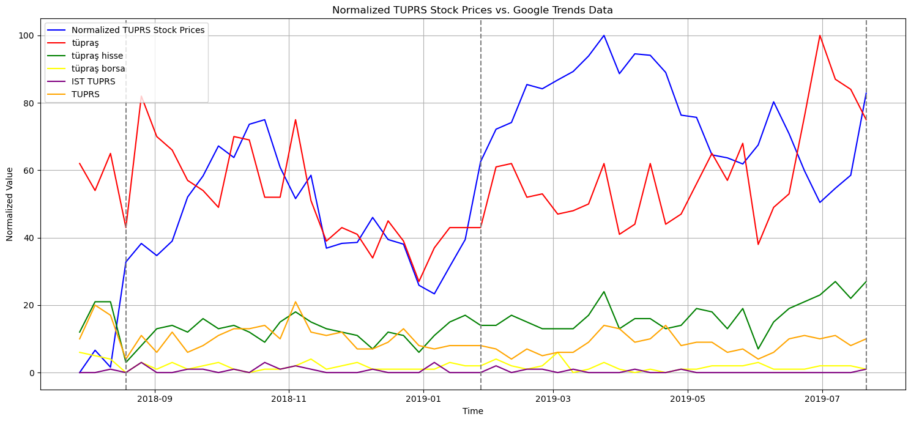
    


```python
parsed_merged_tupras = merged_tupras.drop('Week', axis=1)
parsed_merged_tupras = parsed_merged_tupras.drop('timestamp', axis=1)
trends_correlations = parsed_merged_tupras.rolling(window=6).corr(pairwise=True)
display(trends_correlations)
```


<div>
<style scoped>
    .dataframe tbody tr th:only-of-type {
        vertical-align: middle;
    }

    .dataframe tbody tr th {
        vertical-align: top;
    }

    .dataframe thead th {
        text-align: right;
    }
</style>
<table border="1" class="dataframe">
  <thead>
    <tr style="text-align: right;">
      <th></th>
      <th></th>
      <th>TUPRS</th>
      <th>tüpraş: (Türkiye)</th>
      <th>tüpraş hisse: (Türkiye)</th>
      <th>tüpraş borsa: (Türkiye)</th>
      <th>IST TUPRS: (Türkiye)</th>
      <th>TUPRS: (Türkiye)</th>
      <th>TUPRS_scaled</th>
    </tr>
  </thead>
  <tbody>
    <tr>
      <th rowspan="5" valign="top">0</th>
      <th>TUPRS</th>
      <td>NaN</td>
      <td>NaN</td>
      <td>NaN</td>
      <td>NaN</td>
      <td>NaN</td>
      <td>NaN</td>
      <td>NaN</td>
    </tr>
    <tr>
      <th>tüpraş: (Türkiye)</th>
      <td>NaN</td>
      <td>NaN</td>
      <td>NaN</td>
      <td>NaN</td>
      <td>NaN</td>
      <td>NaN</td>
      <td>NaN</td>
    </tr>
    <tr>
      <th>tüpraş hisse: (Türkiye)</th>
      <td>NaN</td>
      <td>NaN</td>
      <td>NaN</td>
      <td>NaN</td>
      <td>NaN</td>
      <td>NaN</td>
      <td>NaN</td>
    </tr>
    <tr>
      <th>tüpraş borsa: (Türkiye)</th>
      <td>NaN</td>
      <td>NaN</td>
      <td>NaN</td>
      <td>NaN</td>
      <td>NaN</td>
      <td>NaN</td>
      <td>NaN</td>
    </tr>
    <tr>
      <th>IST TUPRS: (Türkiye)</th>
      <td>NaN</td>
      <td>NaN</td>
      <td>NaN</td>
      <td>NaN</td>
      <td>NaN</td>
      <td>NaN</td>
      <td>NaN</td>
    </tr>
    <tr>
      <th>...</th>
      <th>...</th>
      <td>...</td>
      <td>...</td>
      <td>...</td>
      <td>...</td>
      <td>...</td>
      <td>...</td>
      <td>...</td>
    </tr>
    <tr>
      <th rowspan="5" valign="top">51</th>
      <th>tüpraş hisse: (Türkiye)</th>
      <td>0.131337</td>
      <td>0.473842</td>
      <td>1.000000</td>
      <td>0.280828</td>
      <td>5.777144e-01</td>
      <td>2.246624e-01</td>
      <td>0.131337</td>
    </tr>
    <tr>
      <th>tüpraş borsa: (Türkiye)</th>
      <td>-0.763396</td>
      <td>0.779650</td>
      <td>0.280828</td>
      <td>1.000000</td>
      <td>-4.472136e-01</td>
      <td>-3.333333e-01</td>
      <td>-0.763396</td>
    </tr>
    <tr>
      <th>IST TUPRS: (Türkiye)</th>
      <td>0.820043</td>
      <td>-0.130101</td>
      <td>0.577714</td>
      <td>-0.447214</td>
      <td>1.000000e+00</td>
      <td>5.958082e-16</td>
      <td>0.820043</td>
    </tr>
    <tr>
      <th>TUPRS: (Türkiye)</th>
      <td>-0.039166</td>
      <td>-0.058183</td>
      <td>0.224662</td>
      <td>-0.333333</td>
      <td>5.958082e-16</td>
      <td>1.000000e+00</td>
      <td>-0.039166</td>
    </tr>
    <tr>
      <th>TUPRS_scaled</th>
      <td>1.000000</td>
      <td>-0.669174</td>
      <td>0.131337</td>
      <td>-0.763396</td>
      <td>8.200428e-01</td>
      <td>-3.916619e-02</td>
      <td>1.000000</td>
    </tr>
  </tbody>
</table>
<p>364 rows × 7 columns</p>
</div>


```python
trends_correlation_TUPRS_tüpraş = trends_correlations.loc[pd.IndexSlice[:, 'TUPRS'], 'tüpraş: (Türkiye)']
plt.figure(figsize=(14,7))
trends_correlation_TUPRS_tüpraş.plot()
plt.title("Rolling Correlation Between TUPRS and tüpraş")
plt.xlabel("Date")
plt.ylabel("Correlation")
plt.grid(True)
plt.tight_layout()
plt.show()

```


    
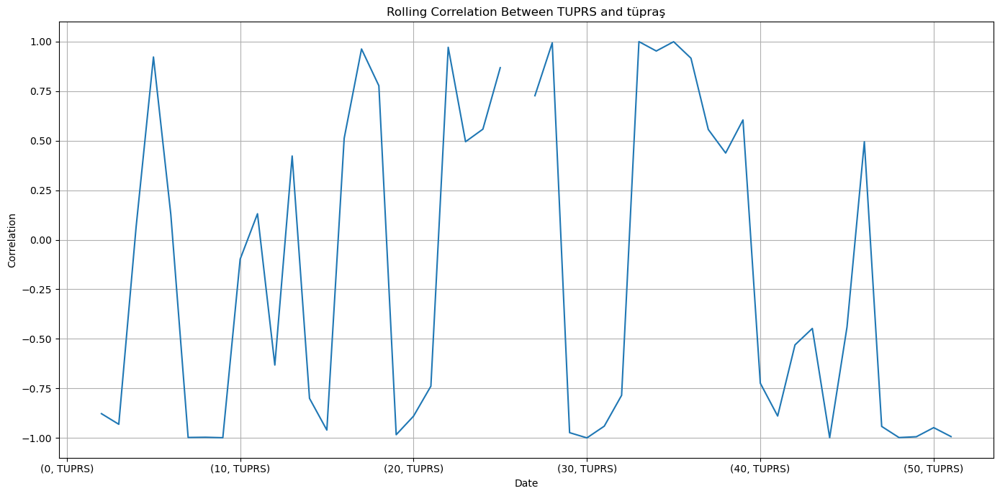
    


```python

```
